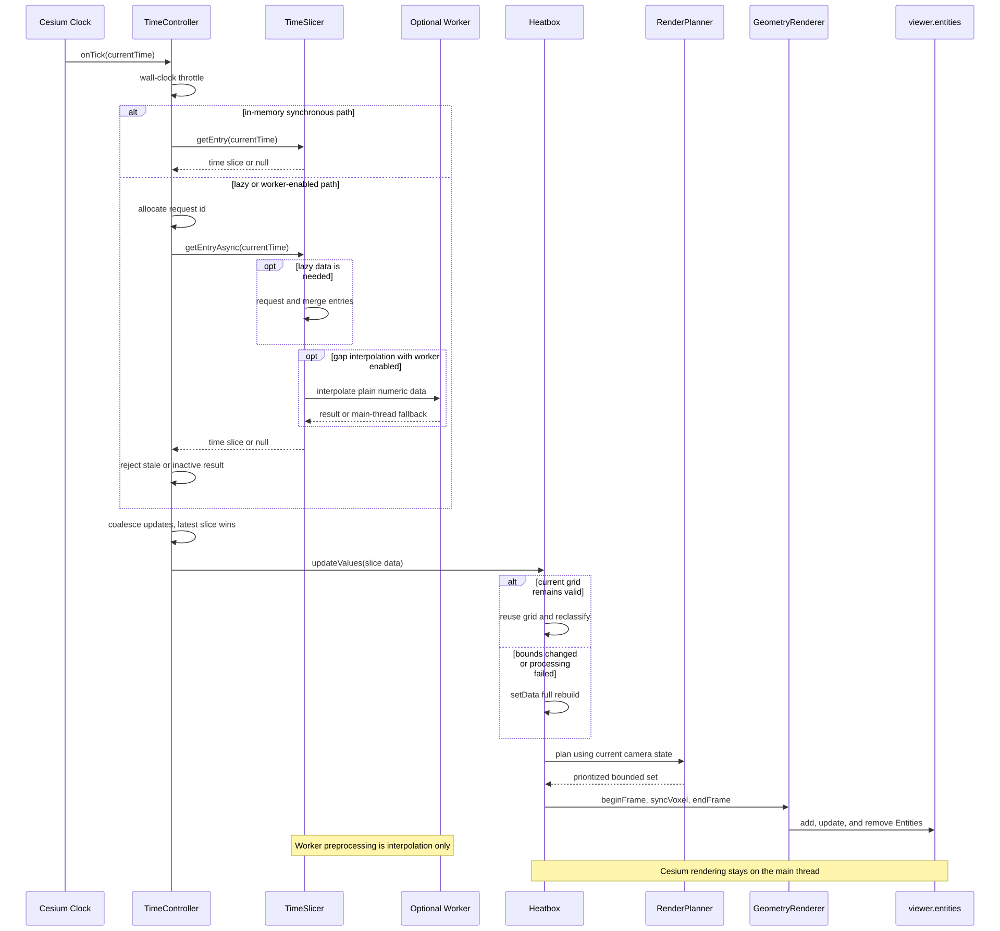

# Cesium Heatbox — Architecture Evidence

This document is a visual index to the current runtime architecture of Cesium Heatbox. The diagrams describe the implementation at source commit [`32bdfcd8ce4e9e983f42deea222a9e1630e7ce5c`](https://github.com/hiro-nyon/cesium-heatbox/tree/32bdfcd8ce4e9e983f42deea222a9e1630e7ce5c). They should be read as implementation maps, not as claims of a custom Cesium renderer.

## 1. Runtime architecture overview

`Heatbox` is the public facade. It resolves Cesium Entity positions, builds either a regular voxel grid or Spatial ID groups, computes statistics and classification, and delegates the display pass to `VoxelRenderer`. Rendering is further separated into candidate selection, camera-aware planning, visual-parameter calculation, and Entity synchronization. Temporal mode is an orchestration layer above the same processing and rendering path rather than a separate renderer.

**Source:** [`Heatbox.setData`](https://github.com/hiro-nyon/cesium-heatbox/blob/32bdfcd8ce4e9e983f42deea222a9e1630e7ce5c/src/Heatbox.js#L637-L723), [`DataProcessor.classifyEntitiesIntoVoxels`](https://github.com/hiro-nyon/cesium-heatbox/blob/32bdfcd8ce4e9e983f42deea222a9e1630e7ce5c/src/core/DataProcessor.js#L26-L150), [`VoxelRenderer.render`](https://github.com/hiro-nyon/cesium-heatbox/blob/32bdfcd8ce4e9e983f42deea222a9e1630e7ce5c/src/core/VoxelRenderer.js#L188-L268)  
**Architecture record:** [ADR-0019 — Current Runtime Architecture](https://github.com/hiro-nyon/cesium-heatbox/blob/8749fc1ee21f84cf2229c0bb0c6be919d60872fc/docs/adr/ADR-0019-v1.3.7-current-runtime-architecture.md)

## 2. CesiumJS integration boundary

Heatbox uses CesiumJS through public Viewer facilities: the default `EntityCollection`, declarative box and polyline graphics, Cartesian/Cartographic conversions, Camera flight, `scene.postRender`, `scene.pick`, `ScreenSpaceEventHandler`, `viewer.selectedEntity`, Clock ticks, and `JulianDate`. `GeometryRenderer` is the component that owns voxel Entity membership. `RenderPlanner` reads Camera state but does not mutate it. `TimeController` subscribes to Viewer events through the supplied Viewer object.

The implemented boundary does not include a production `Primitive`/`GeometryInstance` backend, custom `Appearance`, custom shader, 3D Tiles pipeline, terrain or occlusion culling, or worker-side Cesium rendering.

**Source:** [`GeometryRenderer.createVoxelBox`](https://github.com/hiro-nyon/cesium-heatbox/blob/32bdfcd8ce4e9e983f42deea222a9e1630e7ce5c/src/core/geometry/GeometryRenderer.js#L126-L213), [`Heatbox` scene picking](https://github.com/hiro-nyon/cesium-heatbox/blob/32bdfcd8ce4e9e983f42deea222a9e1630e7ce5c/src/Heatbox.js#L983-L1015), [`Heatbox.fitView` Camera integration](https://github.com/hiro-nyon/cesium-heatbox/blob/32bdfcd8ce4e9e983f42deea222a9e1630e7ce5c/src/Heatbox.js#L1217-L1281), [`TimeController` subscriptions](https://github.com/hiro-nyon/cesium-heatbox/blob/32bdfcd8ce4e9e983f42deea222a9e1630e7ce5c/src/core/temporal/TimeController.js#L77-L120)  
**Architecture record:** [ADR-0019, CesiumJS Integration Surface and Known Limitations](https://github.com/hiro-nyon/cesium-heatbox/blob/8749fc1ee21f84cf2229c0bb0c6be919d60872fc/docs/adr/ADR-0019-v1.3.7-current-runtime-architecture.md#known-limitations--%E6%97%A2%E7%9F%A5%E3%81%AE%E5%88%B6%E7%B4%84)

## 3. Rendering and Entity lifecycle

Each render pass opens a keyed frame, asks `RenderPlanner` for the current display set, synchronizes each selected voxel, and closes the frame. A new key adds an Entity; an existing key updates its box Entity in place; a key absent from the frame is removed from `viewer.entities`. This avoids clearing and rebuilding every box on every update.

Incrementality is **partial**. The primary box Entity is updated in place, but active inset-outline and edge-polyline Entities are removed and recreated during each synchronization. Camera filtering is also a centre-point angular heuristic, not Cesium frustum-plane, near/far, terrain, or occlusion culling.

**Source:** [`VoxelRenderer` frame orchestration](https://github.com/hiro-nyon/cesium-heatbox/blob/32bdfcd8ce4e9e983f42deea222a9e1630e7ce5c/src/core/VoxelRenderer.js#L188-L268), [`GeometryRenderer` keyed synchronization](https://github.com/hiro-nyon/cesium-heatbox/blob/32bdfcd8ce4e9e983f42deea222a9e1630e7ce5c/src/core/geometry/GeometryRenderer.js#L47-L106), [`GeometryRenderer` outline recreation](https://github.com/hiro-nyon/cesium-heatbox/blob/32bdfcd8ce4e9e983f42deea222a9e1630e7ce5c/src/core/geometry/GeometryRenderer.js#L734-L784), [`RenderPlanner` angular filter](https://github.com/hiro-nyon/cesium-heatbox/blob/32bdfcd8ce4e9e983f42deea222a9e1630e7ce5c/src/core/render/RenderPlanner.js#L122-L161)  
**Architecture record:** [ADR-0020 — Incremental Entity Rendering](https://github.com/hiro-nyon/cesium-heatbox/blob/8749fc1ee21f84cf2229c0bb0c6be919d60872fc/docs/adr/ADR-0020-v1.3.0-incremental-entity-rendering.md)

## 4. Temporal sequence and concurrency guards

When temporal mode is enabled, `TimeController` listens to `viewer.clock.onTick`, resolves the current `JulianDate` through `TimeSlicer`, rejects stale asynchronous results by request id, and coalesces overlapping Heatbox updates into one latest queued entry. If current bounds remain reusable, `updateValues` preserves the grid while still reclassifying the supplied Entities, recomputing statistics, and running a diff render pass. Otherwise it falls back to `setData`.

`viewer.camera.changed` is subscribed only by the temporal controller. It re-submits the last temporal entry so the planner sees the new Camera state. A static Heatbox instance has no equivalent Camera listener; Camera motion alone therefore does not re-plan static data. Another render-triggering API call is required.

The lazy `dataSource` boundary also has a precise error-handling limitation. A returned rejected Promise is handled by the existing `.catch`, but a `dataSource` that throws synchronously is evaluated before `Promise.resolve` is established. The resulting rejected async tick has no local event-boundary catch and may surface as an unhandled rejection. This document does not claim that every `dataSource` failure is contained.

**Source:** [`TimeController` tick and staleness handling](https://github.com/hiro-nyon/cesium-heatbox/blob/32bdfcd8ce4e9e983f42deea222a9e1630e7ce5c/src/core/temporal/TimeController.js#L128-L170), [`TimeController` Camera refresh and update coalescing](https://github.com/hiro-nyon/cesium-heatbox/blob/32bdfcd8ce4e9e983f42deea222a9e1630e7ce5c/src/core/temporal/TimeController.js#L172-L267), [`TimeSlicer.getEntryAsync`](https://github.com/hiro-nyon/cesium-heatbox/blob/32bdfcd8ce4e9e983f42deea222a9e1630e7ce5c/src/core/temporal/TimeSlicer.js#L239-L280), [`Heatbox` temporal opt-in](https://github.com/hiro-nyon/cesium-heatbox/blob/32bdfcd8ce4e9e983f42deea222a9e1630e7ce5c/src/Heatbox.js#L346-L349)  
**Architecture record:** [ADR-0021 — Asynchronous Temporal Pipeline](https://github.com/hiro-nyon/cesium-heatbox/blob/8749fc1ee21f84cf2229c0bb0c6be919d60872fc/docs/adr/ADR-0021-v1.3.2-asynchronous-temporal-pipeline.md)

## Implementation scope

The architecture covers Entity lifecycle ownership, geographic coordinate conversion, Camera and Scene event coordination, Clock/JulianDate temporal control, interaction through picking and selected Entity state, and budgeted display planning. It does not implement a low-level GPU renderer or unlimited-scale voxel display.
