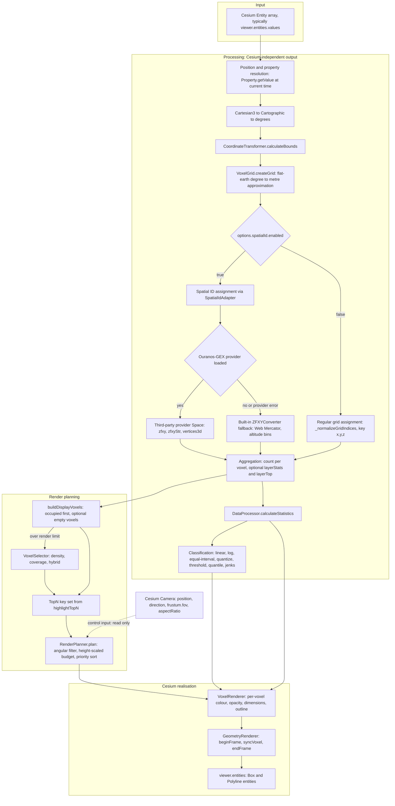
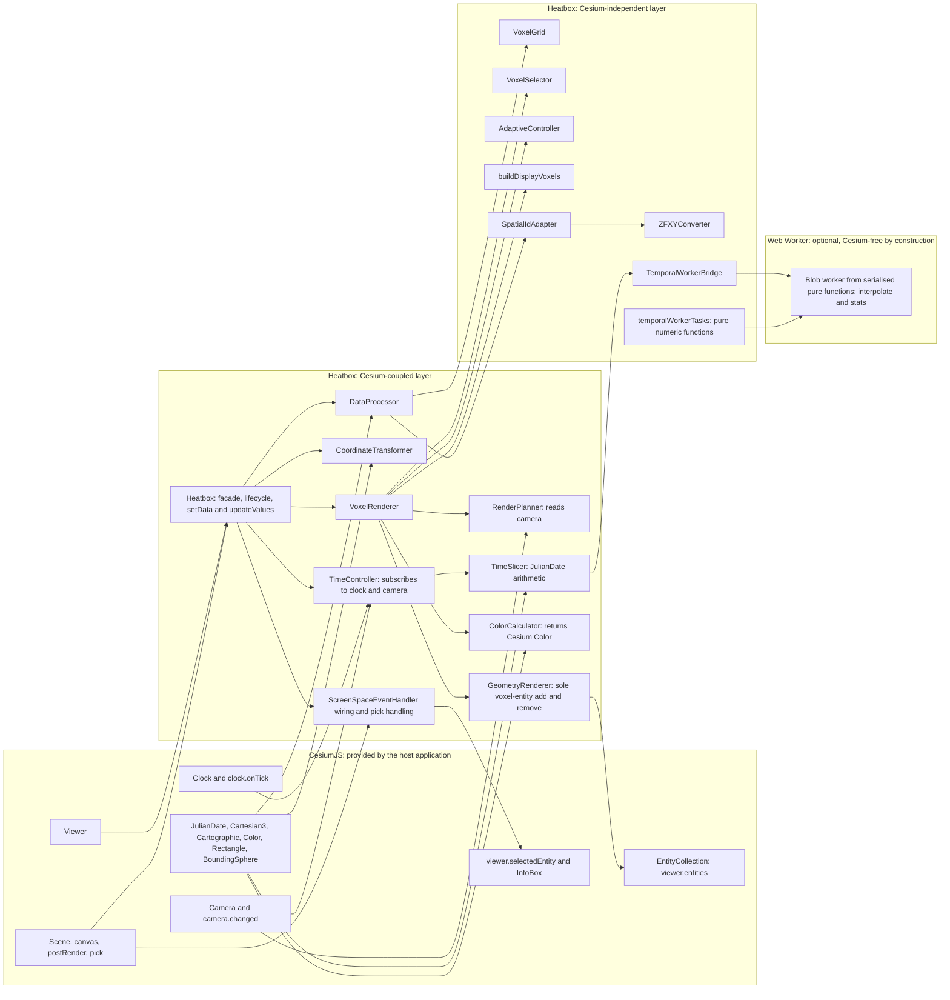
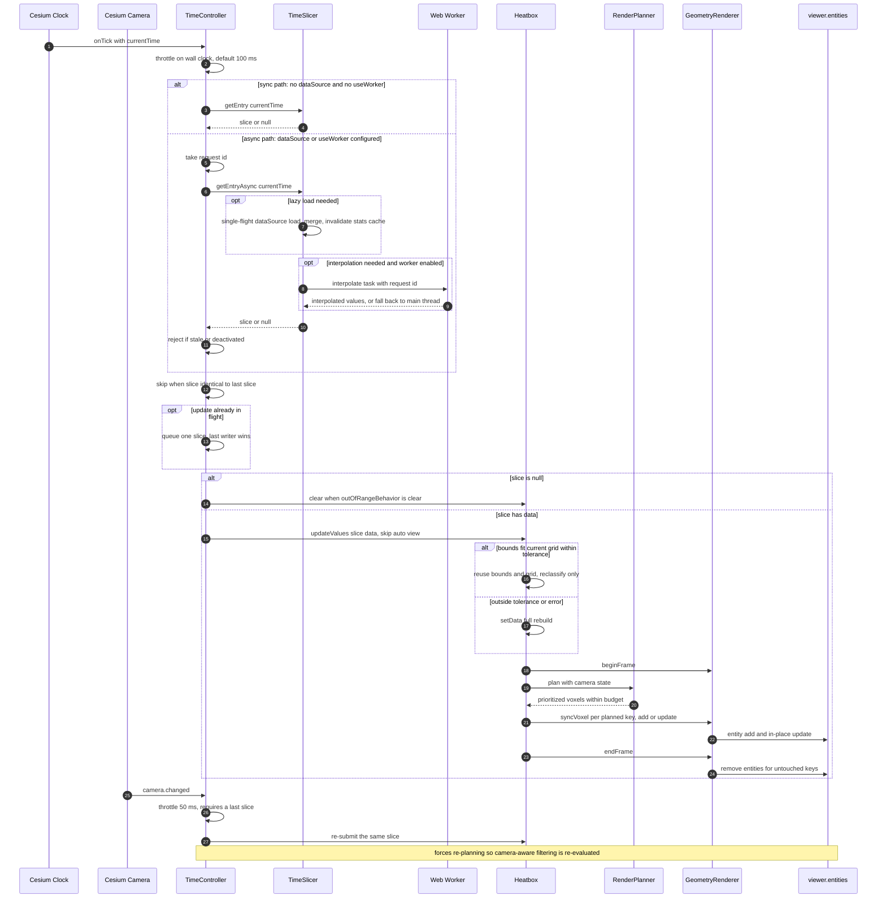

# ADR-0019: Current Runtime Architecture and CesiumJS Integration / 現行ランタイムアーキテクチャと CesiumJS 統合

**Status**: Accepted
**Date**: 2026-08-23
**Author**: hiro-nyon
**Describes / 記述対象**: v1.3.7 — source pinned at commit `32bdfcd8ce4e9e983f42deea222a9e1630e7ce5c`
**Related**: ADR-0009, ADR-0013, ADR-0016, ADR-0017, ADR-0018, ADR-0020, ADR-0021

> **Role of this ADR.** This is not a new feature decision. It is the authoritative map of the architecture that exists today, written as an entry point to the decision records that produced it. It does not replace any earlier ADR; where the current design differs from an earlier decision, the earlier ADR remains the historical record and this document states what the code does now.
>
> **本ADRの位置づけ.** これは新規の機能決定ではない。現在存在するアーキテクチャの正式な地図であり、それを生み出した各決定記録への入口として書かれている。過去のADRを置き換えるものではない。現行設計が過去の決定と異なる場合、過去のADRが歴史的記録として残り、本文書が「今のコードが何をしているか」を述べる。
>
> **Audience.** An experienced CesiumJS or geospatial software engineer who has never seen this repository. Written bilingually: English first, Japanese immediately after. ADR-0001 through ADR-0018 are in Japanese and are retained as historical records.
>
> **想定読者.** 本リポジトリを見たことがない、経験のある CesiumJS／地理空間ソフトウェアエンジニア。日英併記（英語の直後に日本語）。ADR-0001〜ADR-0018 は日本語であり、歴史的記録として保持している。
>
> **Verification basis.** Every module, class, method, and Cesium API named here was read in `src/` at the commit above. Diagram edges correspond to calls that exist in that source. Claims about performance and about capabilities the library does **not** have are stated explicitly in *Known Limitations*.
>
> **検証の基準.** ここで名前を挙げたモジュール、クラス、メソッド、Cesium API はすべて上記コミット時点の `src/` で確認した。図の辺は当該ソースに実在する呼び出しに対応する。性能に関する主張と、ライブラリが **持たない** 機能については *Known Limitations* に明記する。
>
> **Mermaid labels.** Diagram node labels are kept in English for parse safety and legibility; a Japanese reading note follows each diagram.
>
> **Mermaid のラベル.** 図の node label は parse 安全性と可読性のため英語のみとし、各図の直後に日本語の読み方注記を置く。

## Context / 背景

Cesium Heatbox is a client-side library that turns an array of existing `Cesium.Entity` objects into a three-dimensional voxel density visualisation inside a live `Cesium.Viewer`. Its distinguishing choice is that it consumes entities the host application already has, in the browser, with no server-side preprocessing and no pre-tiled dataset — and that it preserves altitude as a rendered dimension rather than flattening it into a 2D texture.

Cesium Heatbox は、既存の `Cesium.Entity` 配列を、稼働中の `Cesium.Viewer` 内で三次元ボクセル密度可視化へ変換するクライアントサイドライブラリである。特徴的な選択は、ホストアプリケーションが既に保持しているエンティティを、サーバ側前処理や事前タイル化なしにブラウザ内で消費すること、そして高度を2Dテクスチャへ平坦化せず描画次元として保持することである。

The architecture reached its present shape through a sequence of decisions, each recorded in its own ADR:

現在の形に至るまでの決定の系列は、それぞれ個別のADRに記録されている。

1. **An initial voxel renderer** with a single class handling aggregation and drawing (ADR-0001, ADR-0002).
   **初期のボクセルレンダラ** — 集約と描画を単一クラスが担当（ADR-0001、ADR-0002）。
2. **A move to an Entity-based renderer.** Early work explored Cesium `Primitive`-based drawing; compatibility across Cesium versions drove the move to `Entity` objects with `BoxGraphics`, which is still the production backend today.
   **Entity 方式レンダラへの移行。** 初期は Cesium `Primitive` による描画を試みたが、Cesium バージョン間の互換性が `BoxGraphics` を持つ `Entity` への移行を促した。これが現在も production backend である。
3. **Outline rendering strategies** to work around practical WebGL line-width limits — inset boxes, twelve-frame boxes, and polyline edges (ADR-0004, ADR-0005).
   **枠線描画戦略** — WebGL の実務的な線幅制約を回避するためのインセットボックス、12枠ボックス、エッジポリライン（ADR-0004、ADR-0005）。
4. **Adaptive rendering limits and camera fitting** (ADR-0006).
   **適応的描画制限とカメラフィット**（ADR-0006）。
5. **Responsibility separation.** A 1,265-line `VoxelRenderer` was decomposed into colour, selection, adaptive-control, and geometry components (ADR-0007 → ADR-0008 → ADR-0009; the first two were superseded before implementation).
   **責務分離.** 1,265行の `VoxelRenderer` を色・選択・適応制御・ジオメトリの各コンポーネントへ分解（ADR-0007 → ADR-0008 → ADR-0009。前2件は実装前に置き換えられた）。
6. **Spatial ID support**, integrating a third-party METI-style Spatial ID provider behind an adapter, with a built-in fallback converter (ADR-0013), plus per-voxel layer aggregation (ADR-0014) and global edge-case QA (ADR-0015).
   **空間ID対応** — 第三者製の METI 系空間ID provider をアダプタ背後に統合し、内蔵フォールバックコンバータを併設（ADR-0013）。加えてボクセル単位のレイヤ集約（ADR-0014）とグローバル端ケースQA（ADR-0015）。
7. **A classification engine** with declarative schemes and a statistics backend (ADR-0016), extended to opacity and width targets plus quantile and Jenks schemes (ADR-0017).
   **分類エンジン** — 宣言的スキームと統計backend（ADR-0016）を、透明度・線幅ターゲットおよび quantile／Jenks スキームへ拡張（ADR-0017）。
8. **Temporal processing** bound to the Cesium clock (ADR-0018).
   **時系列処理** — Cesium clock への結線（ADR-0018）。
9. **Incremental rendering and camera-aware planning** (ADR-0020).
   **差分描画とカメラ考慮の描画計画**（ADR-0020）。
10. **An asynchronous temporal pipeline with lightweight updates** (ADR-0021).
    **非同期時系列パイプラインと軽量更新**（ADR-0021）。

The result is no longer one renderer with helpers. It is a set of subsystems — coordinate resolution, voxel assignment, aggregation, classification, selection, render planning, entity lifecycle management, temporal orchestration, and Spatial ID integration — with a deliberate boundary between the parts that touch CesiumJS and the parts that do not. That boundary is the main thing this document exists to make legible.

結果として、もはや「補助関数を伴う1つのレンダラ」ではない。座標解決、ボクセル割り当て、集約、分類、選択、描画計画、エンティティライフサイクル管理、時系列統括、空間ID統合という複数のサブシステム群であり、CesiumJS に触れる部分と触れない部分の間に意図的な境界がある。この境界を可読にすることが本文書の主目的である。

## Architectural Goals / アーキテクチャ上の目標

These are the goals the current code demonstrably serves. Each is traceable to source or to an existing decision record; aspirational goals are excluded.

以下は現行コードが実際に満たしている目標である。各項目はソースまたは既存の決定記録に追跡可能であり、願望的な目標は除外している。

1. **Consume existing Cesium entities.** The primary input is `Cesium.Entity[]` — typically `viewer.entities.values`. No bespoke data format is required, and the library does not own the entities it reads.
   **既存の Cesium エンティティを消費する。** 主入力は `Cesium.Entity[]`（通常は `viewer.entities.values`）。独自データ形式は不要で、読み取るエンティティの所有権はライブラリ側に無い。
2. **Preserve altitude.** Voxels are three-dimensional cells with a vertical index and a rendered height, so vertical distribution survives into the visualisation.
   **高度を保持する。** ボクセルは垂直インデックスと描画高さを持つ三次元セルであり、垂直方向の分布が可視化に残る。
3. **Separate processing from rendering.** Bounds calculation, voxel assignment, aggregation, and statistics are independent of how anything is drawn.
   **処理と描画を分離する。** 境界計算、ボクセル割り当て、集約、統計は描画方法から独立している。
4. **Isolate Cesium-dependent rendering logic.** All voxel-entity addition and removal is confined to one class (`GeometryRenderer`). Selection and adaptive control are Cesium-free by design (ADR-0009).
   **Cesium 依存の描画ロジックを隔離する。** ボクセルエンティティの追加と削除はすべて1クラス（`GeometryRenderer`）に閉じている。選択と適応制御は設計上 Cesium 非依存である（ADR-0009）。
5. **Support both static and temporal data** through one option surface, with the temporal path opt-in and off by default (`temporal: null`).
   **静的データと時系列データの両方を** 単一のオプション面で扱う。時系列経路はオプトインであり既定は無効（`temporal: null`）。
6. **Maintain predictable lifecycle cleanup.** Every listener, handler, worker, overlay, and entity acquired by the library is released by `destroy()`.
   **予測可能なライフサイクル解放を維持する。** ライブラリが取得したリスナ、ハンドラ、worker、オーバーレイ、エンティティはすべて `destroy()` で解放される。
7. **Remain reusable as a client-side library.** Published to npm with ESM, CommonJS, and UMD builds, conditional TypeScript declarations, a declared Cesium peer dependency range, and CI compatibility checks against both the minimum and the latest Cesium.
   **再利用可能なクライアントサイドライブラリであり続ける。** ESM／CommonJS／UMD ビルド、条件付き TypeScript 宣言、Cesium peer dependency 範囲の明示、最小版と最新版の両方に対する CI 互換性検査を伴って npm 公開されている。
8. **Degrade rather than fail.** Missing camera state disables culling instead of hiding data; an unavailable Spatial ID provider falls back to a built-in converter; an unavailable Web Worker falls back to the main thread; an ineligible fast update falls back to a full rebuild.
   **失敗せず劣化する。** カメラ状態が無ければデータを隠すのではなく culling を無効化する。空間ID provider が使えなければ内蔵コンバータへ、Web Worker が使えなければメインスレッドへ、高速更新の条件を満たさなければ完全再構築へフォールバックする。

## Current Runtime Architecture / 現行ランタイムアーキテクチャ

### Entry point and orchestration / エントリポイントと統括

**`Heatbox`** (`src/Heatbox.js`) — the public facade and the only class that owns Cesium subscriptions besides `TimeController`. It validates the viewer, applies profile presets and then defaults, normalises options, constructs the renderer, installs a click handler, and optionally installs a performance overlay and a temporal controller. It owns the `setData` / `updateValues` decision, `fitView`, statistics assembly, legend creation, and teardown. It holds the authoritative `_bounds`, `_grid`, `_voxelData`, and `_statistics` for the current visualisation.

**`Heatbox`**（`src/Heatbox.js`）— 公開ファサードであり、`TimeController` 以外で Cesium 購読を所有する唯一のクラス。viewer を検証し、プロファイルプリセット→既定値の順に適用してオプションを正規化し、レンダラを生成し、クリックハンドラを設置し、必要に応じて performance overlay と temporal controller を設置する。`setData`／`updateValues` の判断、`fitView`、統計の組み立て、凡例生成、破棄処理を所有する。現在の可視化に対する正式な `_bounds`、`_grid`、`_voxelData`、`_statistics` を保持する。

### Data processing / データ処理

**`CoordinateTransformer`** (`src/core/CoordinateTransformer.js`) — computes the 3D geographic bounds of an entity array. For each entity it resolves `entity.position`, calling `getValue(JulianDate.now())` when the position is a Cesium `Property` and reading it directly otherwise, then converts `Cartesian3` to `Cartographic` via `Cesium.Cartographic.fromCartesian` and to degrees via `Cesium.Math.toDegrees`. Entities without a resolvable position are skipped with a warning.

**`CoordinateTransformer`** — エンティティ配列の3D地理境界を計算する。各エンティティについて `entity.position` を解決し（Cesium `Property` なら `getValue(JulianDate.now())`、そうでなければ直接読み取り）、`Cesium.Cartographic.fromCartesian` で `Cartesian3` を `Cartographic` へ、`Cesium.Math.toDegrees` で度へ変換する。位置が解決できないエンティティは警告つきでスキップする。

**`VoxelGrid`** (`src/core/VoxelGrid.js`) — derives grid dimensions from bounds and a target voxel size. Degrees are converted to metres with a flat-earth approximation: `(maxLon - minLon) * 111000 * cos(centreLatitude)` for longitude and `(maxLat - minLat) * 111000` for latitude. Cell counts are `ceil(rangeMetres / voxelSize)` per axis, so actual cell sizes are at or below the requested size; the vertical cell size has a 1 m floor. Also owns the voxel key format, `"x,y,z"`. Contains no Cesium code.

**`VoxelGrid`** — 境界と目標ボクセルサイズからグリッド寸法を導出する。度→メートル変換は平面近似（経度は `(maxLon - minLon) * 111000 * cos(中心緯度)`、緯度は `(maxLat - minLat) * 111000`）。各軸のセル数は `ceil(rangeMetres / voxelSize)` なので、実セルサイズは要求サイズ以下になる。垂直セルサイズには 1 m の下限がある。voxel key 形式 `"x,y,z"` もここが所有する。Cesium コードを含まない。

**`DataProcessor`** (`src/core/DataProcessor.js`) — assigns entities to voxels and computes statistics. `classifyEntitiesIntoVoxels` branches on `options.spatialId.enabled` between the regular-grid path and the Spatial ID path. Both paths resolve positions the same way as `CoordinateTransformer`, reject out-of-range points with a small tolerance, and produce a `Map` of compact voxel records — `{ x, y, z, count }` plus optional `layerStats`, `layerTop`, `spatialId`, and `bounds`. Source entities are **not** retained on the records. When aggregation is enabled it resolves a layer key per entity, reading a `Cesium.PropertyBag` via `entity.properties.getValue(currentTime)` with a direct-property fallback, and computes the dominant layer per voxel. `calculateStatistics` produces the density statistics and classification metadata, and accepts a precomputed domain through `options._externalStats` for temporal global scope.

**`DataProcessor`** — エンティティをボクセルへ割り当て、統計を計算する。`classifyEntitiesIntoVoxels` は `options.spatialId.enabled` で一様グリッド経路と空間ID経路に分岐する。両経路は `CoordinateTransformer` と同じ方法で位置を解決し、わずかな許容差つきで範囲外の点を除外し、コンパクトな voxel record の `Map` を生成する（`{ x, y, z, count }` に任意の `layerStats`、`layerTop`、`spatialId`、`bounds`）。元エンティティは record に **保持しない**。集約有効時はエンティティごとにレイヤキーを解決する（`entity.properties.getValue(currentTime)` で `Cesium.PropertyBag` を読み、直接プロパティへフォールバック）。`calculateStatistics` は密度統計と分類メタデータを生成し、時系列 global scope 用に `options._externalStats` 経由の事前計算済みドメインを受け付ける。

### Spatial ID integration / 空間ID統合

**`SpatialIdAdapter`** (`src/core/spatial/SpatialIdAdapter.js`) — the provider abstraction. `loadProvider()` dynamically imports `ouranos-gex-lib-for-javascript` and, on any failure, sets `fallbackMode` and continues. `getVoxelBounds(lng, lat, alt, zoom)` returns `{ zfxy, zfxyStr, vertices }` from the provider's `Space` class when available, from the built-in converter otherwise, and also on a provider error. The adapter additionally owns zoom selection for a target cell size (`calculateOptimalZoom`, searching zoom 15–30 against a tolerance), vertex normalisation, and tile traversal — `neighbors` (eight-connected in X/Y, with dateline wrapping in X), `children`, and `parent`.

**`SpatialIdAdapter`** — provider の抽象化層。`loadProvider()` は `ouranos-gex-lib-for-javascript` を動的 import し、失敗時は `fallbackMode` を立てて処理を継続する。`getVoxelBounds(lng, lat, alt, zoom)` は provider が利用可能なら `Space` クラスから、そうでなければ（および provider がエラーを投げた場合も）内蔵コンバータから `{ zfxy, zfxyStr, vertices }` を返す。アダプタはさらに、目標セルサイズに対するズーム選択（`calculateOptimalZoom`。許容差に対して zoom 15〜30 を探索）、頂点正規化、タイル走査（`neighbors` は X/Y の8近傍で X 方向は日付変更線をラップ、`children`、`parent`）を所有する。

**`ZFXYConverter`** (`src/core/spatial/ZFXYConverter.js`) — the built-in fallback. Web Mercator tile computation for X/Y, fixed altitude binning for F, eight-vertex bounds, longitude normalisation, and latitude clamping to ±85.0511287798°. Written for this project; contains no Cesium code.

**`ZFXYConverter`** — 内蔵フォールバック。X/Y は Web Mercator タイル計算、F は固定高度ビニング、8頂点境界、経度正規化、緯度は ±85.0511287798° にクランプ。本プロジェクトのために書かれたもので、Cesium コードを含まない。

**`SpatialIdQaMetrics`** (`src/core/spatial/SpatialIdQaMetrics.js`) — `computeSpatialIdEdgeCaseMetrics(adapter)`, called once per Spatial ID render from `Heatbox._finalizeVoxelRender` and folded into statistics.

**`SpatialIdQaMetrics`** — `computeSpatialIdEdgeCaseMetrics(adapter)`。空間ID描画ごとに1回 `Heatbox._finalizeVoxelRender` から呼ばれ、統計へ統合される。

**Attribution.** The ZFXY encoding implementation used in the primary path is third-party: `ouranos-gex-lib-for-javascript`, MIT-licensed, maintained by Geolonia Inc., pinned in this repository to commit `5742889f20645fb0451c4870e5c54b5d34ab5c31`. This project authored the adapter, the zoom-selection logic, the tile traversal helpers, the fallback converter, and the integration into voxel assignment — not the provider's Spatial ID implementation.

**帰属.** 主経路で用いる ZFXY エンコーディング実装は第三者製である — `ouranos-gex-lib-for-javascript`、MIT ライセンス、Geolonia Inc. がメンテナンス、本リポジトリではコミット `5742889f20645fb0451c4870e5c54b5d34ab5c31` に固定。本プロジェクトが著したのはアダプタ、ズーム選択ロジック、タイル走査ヘルパー、フォールバックコンバータ、およびボクセル割り当てへの統合であり、provider の空間ID実装そのものではない。

### Classification / 分類

**`src/utils/classification.js`** — `createClassifier` supporting seven schemes: `linear`, `log`, `equal-interval`, `quantize`, `threshold`, `quantile`, `jenks`. Accepts precomputed breaks so a domain can be fixed externally (used by temporal global scope). **`src/utils/classificationBackend.js`** delegates quantile and summary statistics to the `simple-statistics` package — the sole runtime dependency of the published library. Classification targets (`colour`, opacity, width) are configured through `classificationTargets`.

**`src/utils/classification.js`** — `createClassifier` が7スキーム（`linear`、`log`、`equal-interval`、`quantize`、`threshold`、`quantile`、`jenks`）をサポートする。事前計算済み breaks を受け付けるため、ドメインを外部から固定できる（時系列 global scope が利用）。**`src/utils/classificationBackend.js`** は quantile と要約統計を `simple-statistics` パッケージへ委譲する — これが公開ライブラリの唯一のランタイム依存である。分類ターゲット（色、透明度、線幅）は `classificationTargets` で設定する。

### Rendering / 描画

**`VoxelRenderer`** (`src/core/VoxelRenderer.js`) — the render orchestrator. It constructs and drives `VoxelSelector`, `AdaptiveController`, `GeometryRenderer`, and `RenderPlanner`, and calls `ColorCalculator` statically. A render pass runs in a fixed order: open a diff frame, clear debug entities, refresh planner options, prepare the classifier, optionally draw the debug bounding box, build the eligible voxel list, compute the TopN key set, plan, compute per-voxel visual parameters, sync each planned voxel, close the frame.

**`VoxelRenderer`** — 描画のオーケストレータ。`VoxelSelector`、`AdaptiveController`、`GeometryRenderer`、`RenderPlanner` を生成・駆動し、`ColorCalculator` を静的に呼ぶ。描画パスは固定順序で進む — 差分フレーム開始、デバッグエンティティ削除、planner オプション更新、分類器準備、必要ならデバッグ境界ボックス描画、候補ボクセル一覧構築、TopN キー集合算出、計画、ボクセル単位の視覚パラメータ計算、計画された各ボクセルの sync、フレーム終了。

**`buildDisplayVoxels`** (`src/core/render/buildDisplayVoxels.js`) — builds the eligible voxel list. Occupied voxels always take precedence; synthetic empty voxels are appended only when `showEmptyVoxels` is on and Spatial ID mode is off. Invokes the selection callback only when the occupied set exceeds the render limit.

**`buildDisplayVoxels`** — 候補ボクセル一覧を構築する。占有ボクセルが常に優先され、合成された空ボクセルは `showEmptyVoxels` が有効かつ空間IDモードが無効な場合にのみ追加される。占有集合が描画上限を超えた場合にのみ選択コールバックを呼ぶ。

**`VoxelSelector`** (`src/core/selection/VoxelSelector.js`) — selection strategies `density`, `coverage` (stratified), and `hybrid`, with TopN forcing and a density-sort fallback on error. Documented and implemented as pure and Cesium-free.

**`VoxelSelector`** — 選択戦略 `density`、`coverage`（層化抽出）、`hybrid`。TopN の強制包含に対応し、エラー時は密度ソートへフォールバックする。純粋かつ Cesium 非依存として文書化・実装されている。

**`AdaptiveController`** (`src/core/adaptive/AdaptiveController.js`) — neighbourhood density, preset logic, vertical scale compensation, overlap detection, and the resulting adaptive outline width and opacity parameters. Cesium-free.

**`AdaptiveController`** — 近傍密度、プリセットロジック、垂直スケール補正、重なり検出、およびそれらから導く適応的な枠線幅・透明度パラメータ。Cesium 非依存。

**`ColorCalculator`** (`src/core/color/ColorCalculator.js`) — colour interpolation, perceptual colour maps, and diverging schemes. Returns `Cesium.Color`.

**`ColorCalculator`** — 色補間、知覚均等カラーマップ、二極性配色。`Cesium.Color` を返す。

**`RenderPlanner`** (`src/core/render/RenderPlanner.js`) — reads camera state and returns a plan: `plan(voxels, bounds, grid, topNVoxels, baseBudget) -> { voxels, budget, culledCount }`. Applies an angular visibility filter, a height-scaled budget, and a priority sort weighting TopN membership above density above camera proximity. Reads the camera; never mutates entities. See ADR-0020.

**`RenderPlanner`** — カメラ状態を読んで計画を返す。角度による可視性フィルタ、高度スケール予算、そして TopN 所属 > 密度 > カメラ近接 の重み付けによる優先度ソートを適用する。カメラを読むのみで、エンティティを変更しない。ADR-0020 参照。

**`GeometryRenderer`** (`src/core/geometry/GeometryRenderer.js`) — the **only** class that adds voxel entities to, or removes them from, `viewer.entities`. Owns a `Map` from voxel key to a render record and exposes a three-phase frame protocol, `beginFrame()` / `syncVoxel(config)` / `endFrame()`, which adds new voxels, updates existing box entities in place, and removes records not touched during the frame. Also builds inset outlines, twelve-frame thick outlines, edge polylines, HTML voxel descriptions, and the debug bounding box. See ADR-0020.

**`GeometryRenderer`** — `viewer.entities` に対してボクセルエンティティを追加・削除する **唯一** のクラス。voxel key から render record への `Map` を所有し、3フェーズのフレームプロトコル `beginFrame()` / `syncVoxel(config)` / `endFrame()` を公開する。これにより新規ボクセルの追加、既存 box entity のその場更新、当該フレームで触れられなかった record の削除を行う。インセット枠線、12枠の太枠線、エッジポリライン、HTML ボクセル説明、デバッグ境界ボックスの構築も担う。ADR-0020 参照。

### Temporal processing / 時系列処理

**`TimeController`** (`src/core/temporal/TimeController.js`) — subscribes to `viewer.clock.onTick` and `viewer.camera.changed`, throttles on wall-clock time, detects slice changes by reference identity, rejects stale asynchronous results by request id, coalesces concurrent updates into a single-slot queue, and drives `Heatbox.updateValues()`. Notably it does **not** import Cesium — the viewer is duck-typed — yet it is squarely a Cesium-integration component.

**`TimeController`** — `viewer.clock.onTick` と `viewer.camera.changed` を購読し、実時間で throttle し、参照同一性でスライス変更を検知し、request id で陳腐化した非同期結果を拒否し、同時更新を単一スロットのキューへ合流させ、`Heatbox.updateValues()` を駆動する。注目すべき点として、Cesium を **import しない**（viewer は duck typing）が、まさに Cesium 統合コンポーネントである。

**`TimeSlicer`** (`src/core/temporal/TimeSlicer.js`) — normalises, sorts, and de-overlaps time entries; resolves a `JulianDate` to a slice through a cached-entry check, a ±1 neighbour scan, and a binary search; optionally interpolates across gaps; optionally lazy-loads through an async `dataSource` with a single-flight guard; and computes global statistics with caching. Imports Cesium for `JulianDate` arithmetic and comparison.

**`TimeSlicer`** — 時刻エントリを正規化・ソート・重複解消し、キャッシュ判定 → ±1 近傍走査 → 二分探索の順で `JulianDate` をスライスへ解決する。任意でギャップを補間し、任意で single-flight ガード付きの非同期 `dataSource` から遅延ロードし、キャッシュ付きで全体統計を計算する。`JulianDate` の演算と比較のため Cesium を import する。

**`TemporalWorkerBridge`** / **`TemporalWorkerScript`** / **`temporalWorkerTasks`** (`src/core/temporal/`) — an optional Web Worker for interpolation and value statistics. The worker script is generated by serialising the pure functions in `temporalWorkerTasks.js` with `Function.prototype.toString()` into a Blob, so it contains no Cesium code and no DOM access. The bridge correlates requests by id and falls back to the main thread whenever the worker is unavailable, errors, or returns an unusable result. See ADR-0021.

**`TemporalWorkerBridge`** / **`TemporalWorkerScript`** / **`temporalWorkerTasks`** — 補間と値統計のための任意の Web Worker。worker script は `temporalWorkerTasks.js` の純粋関数を `Function.prototype.toString()` で Blob へ直列化して生成されるため、Cesium コードも DOM アクセスも含まない。bridge は id でリクエストを対応付け、worker が利用不能・エラー・利用不能な結果を返した場合はメインスレッドへフォールバックする。ADR-0021 参照。

### Supporting modules / 補助モジュール

**`src/ui/Legend.js`** — an optional DOM legend. **`src/utils/performanceOverlay.js`** — an optional DOM overlay fed from a `scene.postRender` listener installed by `Heatbox`. **`src/utils/validation.js`** — option normalisation and viewer/entity validation. **`src/utils/cesiumProperty.js`** — `resolvePropertyValue(property, time)`, the single helper for evaluating a Cesium `Property` or a raw value at a given time. **`src/utils/deviceTierDetector.js`** — heuristic render-budget selection from device signals. **`src/utils/profiles.js`** — named option presets. Plus `colorMap`, `constants`, `logger`, `escapeHtml`, `deprecate`, and `sampleData`.

**`src/ui/Legend.js`** — 任意の DOM 凡例。**`src/utils/performanceOverlay.js`** — `Heatbox` が設置する `scene.postRender` リスナから供給される任意の DOM オーバーレイ。**`src/utils/validation.js`** — オプション正規化と viewer／エンティティ検証。**`src/utils/cesiumProperty.js`** — `resolvePropertyValue(property, time)`。Cesium `Property` または生値を指定時刻で評価する唯一のヘルパー。**`src/utils/deviceTierDetector.js`** — デバイス信号からのヒューリスティックな描画予算選択。**`src/utils/profiles.js`** — 名前付きオプションプリセット。加えて `colorMap`、`constants`、`logger`、`escapeHtml`、`deprecate`、`sampleData`。

### Dependency direction / 依存方向

`Heatbox` → `VoxelRenderer` → { `VoxelSelector`, `AdaptiveController`, `RenderPlanner`, `GeometryRenderer`, `ColorCalculator` }, and `Heatbox` → { `CoordinateTransformer`, `VoxelGrid`, `DataProcessor`, `TimeController` }; `DataProcessor` → `SpatialIdAdapter` → `ZFXYConverter`; `TimeController` → `TimeSlicer` → `TemporalWorkerBridge`. There are no reverse references from a component back to its orchestrator, and none between sibling render components.

上記の依存方向に加え、コンポーネントからオーケストレータへの逆参照は存在せず、描画コンポーネント同士の相互参照も存在しない。

## CesiumJS Integration Boundaries / CesiumJS 統合境界

Heatbox orchestrates CesiumJS; it does not reimplement it. The distinction below is precise because misreading it in either direction gives a wrong picture of the library.

Heatbox は CesiumJS を統括するのであって、再実装するのではない。以下の区別を正確にしているのは、どちら方向に誤読してもライブラリの姿を誤って理解することになるからである。

### What CesiumJS provides / CesiumJS が提供するもの

| CesiumJS API | How Heatbox uses it / Heatbox の使い方 |
|---|---|
| `Viewer` | Supplied by the host application, validated, and retained. Heatbox never creates one. ホストアプリケーションから受け取り、検証して保持する。Heatbox が生成することはない |
| `EntityCollection` (`viewer.entities`) | The render target. Heatbox adds, mutates, and removes entities through it. Cesium owns the collection, its change events, and its rendering. 描画先。Heatbox はこれを通じてエンティティを追加・変更・削除する。コレクション自体、その変更イベント、描画は Cesium が所有 |
| `Entity`, `BoxGraphics`, `PolylineGraphics` | The output primitives. Heatbox sets `position`, `box.dimensions`, `box.material`, `box.outline*`, `box.fill`, `polyline.*`, `properties`, and `description`. Cesium performs all drawing. 出力要素。Heatbox は左記プロパティを設定する。描画はすべて Cesium が行う |
| `Camera` | Read for `position`, `positionCartographic`, `direction`, `frustum.fov`, and `frustum.aspectRatio`. Written only via `flyToBoundingSphere`. 左記を読み取る。書き込みは `flyToBoundingSphere` 経由のみ |
| `camera.changed` | Event source for camera-triggered temporal refresh. カメラ起点の時系列再描画のイベント源 |
| `Scene`, `scene.canvas` | Canvas used for the event handler and for aspect-ratio fallback. イベントハンドラ用およびアスペクト比フォールバック用に canvas を使用 |
| `scene.postRender` | Used twice: a one-shot listener to sequence camera fitting after a render, and a persistent listener driving the performance overlay. 2用途 — 描画後にカメラフィットを1回だけ実行する one-shot リスナ、および performance overlay を駆動する常設リスナ |
| `scene.pick` | Hit testing on left click. 左クリック時のヒットテスト |
| `viewer.selectedEntity` | Written to drive Cesium's own InfoBox. Cesium 自身の InfoBox を駆動するために書き込む |
| `ScreenSpaceEventHandler`, `ScreenSpaceEventType.LEFT_CLICK` | Click input. Destroyed on teardown. クリック入力。破棄時に destroy する |
| `Clock` (`viewer.clock`), `clock.onTick` | Simulation-time source and tick event for temporal updates. シミュレーション時刻の源と、時系列更新用の tick イベント |
| `JulianDate` | All temporal arithmetic: parsing, comparison, `secondsDifference`, `addSeconds`, `now`. 時刻演算のすべて — parse、比較、`secondsDifference`、`addSeconds`、`now` |
| `Cartesian3`, `Cartographic`, `Math.toDegrees`/`toRadians` | Position resolution and geographic conversion. 位置解決と地理座標変換 |
| `Property` / `PropertyBag` (`getValue(time)`) | Time-aware evaluation of entity positions and properties. エンティティ位置・プロパティの時刻考慮評価 |
| `Rectangle`, `BoundingSphere`, `Ellipsoid.WGS84`, `HeadingPitchRange` | Camera fitting geometry. カメラフィット用ジオメトリ |
| `Color` | Voxel and outline colours. ボクセルと枠線の色 |
| `viewer.zoomTo` | Fallback when bounding-sphere fitting fails. bounding sphere フィット失敗時のフォールバック |
| `defined` | Guard in the pick handler. pick ハンドラ内のガード |

### What Heatbox orchestrates / Heatbox が統括するもの

| Heatbox responsibility / 責務 | Where / 実装箇所 |
|---|---|
| Time-aware resolution of entity positions and properties into plain values エンティティ位置・プロパティの時刻考慮解決 | `CoordinateTransformer`, `DataProcessor`, `resolvePropertyValue` |
| 3D bounds computation over an entity array エンティティ配列に対する3D境界計算 | `CoordinateTransformer` |
| Voxel grid derivation from bounds and target cell size 境界と目標セルサイズからのグリッド導出 | `VoxelGrid` |
| Voxel assignment — regular grid or Spatial ID tile ボクセル割り当て（一様グリッドまたは空間IDタイル） | `DataProcessor` |
| Density aggregation and per-voxel layer aggregation 密度集約とボクセル単位レイヤ集約 | `DataProcessor` |
| Statistics, histograms, and classification breaks 統計、ヒストグラム、分類 breaks | `DataProcessor`, `classification`, `classificationBackend` |
| Classification of values to colour, opacity, and width 値から色・透明度・線幅への分類 | `classification`, `ColorCalculator`, `AdaptiveController` |
| Render-candidate selection under a budget 予算下での描画候補選択 | `VoxelSelector`, `buildDisplayVoxels` |
| Camera-aware prioritisation, angular filtering, budget scaling カメラ考慮の優先順位付け、角度フィルタ、予算スケーリング | `RenderPlanner` |
| Entity lifecycle coordination — keyed add / update / remove エンティティライフサイクルの調停（キー付き add/update/remove） | `GeometryRenderer`; visibility toggling in `VoxelRenderer.setVisible` 可視性切り替えは `VoxelRenderer.setVisible` |
| Outline strategies working around WebGL line-width limits WebGL 線幅制約を回避する枠線戦略 | `GeometryRenderer` |
| Temporal orchestration — throttling, staleness, coalescing, fast-path choice 時系列統括（throttle、陳腐化、coalescing、高速経路選択） | `TimeController`, `Heatbox` |
| Time-slice resolution, interpolation, lazy loading 時刻断面の解決、補間、遅延ロード | `TimeSlicer` |
| Optional worker offload of numeric preprocessing 数値前処理の任意 worker offload | `TemporalWorkerBridge` |
| Spatial ID provider abstraction, zoom selection, fallback conversion 空間ID provider 抽象化、ズーム選択、フォールバック変換 | `SpatialIdAdapter`, `ZFXYConverter` |
| Option validation, normalisation, profiles, deprecation warnings オプション検証・正規化・プロファイル・非推奨警告 | `validation`, `profiles`, `deprecate` |
| Deterministic teardown of every acquired resource 取得した全リソースの決定論的破棄 | `Heatbox.destroy` |

**Not Heatbox's work, and never described as such**: scene graph management, the render loop, WebGL state, tile and terrain loading, entity change propagation, the InfoBox widget itself, camera flight interpolation, and the Spatial ID encoding implementation in the primary path.

**Heatbox の仕事ではなく、そう記述してもいないもの**: scene graph 管理、render loop、WebGL 状態、タイル／地形ロード、エンティティ変更の伝播、InfoBox ウィジェット自体、カメラ飛行の補間、主経路における空間IDエンコーディング実装。

## Diagram A — Runtime data flow / 図A — ランタイムデータフロー

Static path, plus the camera's control-flow input to planning. Every edge corresponds to a call in `src/`.

静的経路と、計画へのカメラからの制御フロー入力。すべての辺が `src/` 内の呼び出しに対応する。

Note the two distinct reduction stages: `VoxelSelector` decides *eligibility* without any knowledge of the camera, and `RenderPlanner` then decides *what to draw now* using camera state. The dashed edge is control input, not data flow — the planner reads the camera and writes nothing back.

**日本語での読み方**: 縮約段階が2つあることに注意する。`VoxelSelector` はカメラを一切知らずに *候補性* を決め、その後 `RenderPlanner` がカメラ状態を用いて *今何を描くか* を決める。破線は制御入力であってデータフローではない — planner はカメラを読むだけで、何も書き戻さない。入力から順に、位置・プロパティの時刻評価 → 座標変換 → 境界 → グリッド → 一様グリッドまたは空間ID割り当て（provider 有無で分岐）→ 集約 → 統計・分類 → 候補構築・選択 → TopN → 計画 → ボクセル単位の視覚パラメータ → `GeometryRenderer` → `viewer.entities`。

## Diagram B — CesiumJS integration boundary / 図B — CesiumJS 統合境界

Partitioned by **coupling**, not by import statement. `TimeController` does not import Cesium but subscribes to Cesium events, so it belongs on the Cesium-coupled side.

分割の基準は import 文ではなく **結合** である。`TimeController` は Cesium を import しないが Cesium イベントを購読するため、Cesium 結合側に属する。

Read the diagram for two facts. First, **exactly one arrow reaches `EntityCollection`** — from `GeometryRenderer`. Every voxel-entity *addition and removal* in the library passes through that single point. Two qualifications keep this precise: `VoxelRenderer.setVisible(show)` toggles `entity.show` directly on entities that `GeometryRenderer` created (`src/core/VoxelRenderer.js:767`), so it mutates entity state without going through the geometry layer; and the exported test-data helper `generateTestEntities` in `src/utils/sampleData.js` adds *input* point entities to the viewer, which are Heatbox input rather than Heatbox render output. Second, the Web Worker is reachable only from the Cesium-independent layer, and its script is assembled from pure numeric functions, so Cesium work cannot occur inside it.

**日本語での読み方**: 図から2つの事実を読み取る。第一に、**`EntityCollection` に到達する矢印は `GeometryRenderer` からの1本だけ** である。ライブラリ内のボクセルエンティティの *追加と削除* はすべてこの1点を通る。正確を期すための2つの限定がある — `VoxelRenderer.setVisible(show)` は `GeometryRenderer` が生成したエンティティの `entity.show` を直接切り替えるため（`src/core/VoxelRenderer.js:767`）、geometry 層を経由せずにエンティティ状態を変更する。また `src/utils/sampleData.js` の公開テストデータヘルパー `generateTestEntities` は viewer へ *入力* 用の point エンティティを追加するが、これは Heatbox の描画出力ではなく Heatbox への入力である。第二に、Web Worker は Cesium 非依存層からのみ到達可能であり、そのスクリプトは純粋な数値関数から組み立てられるため、内部で Cesium の処理は起こり得ない。

## Diagram C — Temporal update sequence / 図C — 時系列更新シーケンス

Condensed. ADR-0021 carries the full sequence including every fallback branch.

要約版である。すべてのフォールバック分岐を含む完全なシーケンスは ADR-0021 にある。

**日本語での読み方**: `clock.onTick` から始まり、実時間 throttle（既定 100 ms）を通過した後、`dataSource` または `useWorker` の設定有無で同期経路と非同期経路に分岐する。非同期経路では request id による陳腐化判定が入る。続いて参照同一性による変更検知、進行中なら単一スロットへの待機（後着優先）、`null` なら `outOfRangeBehavior` に従うクリア、データありなら `updateValues`（境界が許容差内なら既存グリッド再利用、そうでなければ `setData` で完全再構築）。最後に差分描画（`beginFrame` → `plan` → `syncVoxel` → `endFrame`）。図の末尾は独立した経路で、`camera.changed` が 50 ms throttle のうえ同一スライスを再投入し、カメラ考慮フィルタを再評価させる。

## CesiumJS version compatibility policy / CesiumJS バージョン互換性ポリシー

The supported range is declared and enforced rather than assumed:

対応範囲は仮定ではなく、宣言され強制されている。

- `peerDependencies` declares `cesium: ^1.120.0`. Cesium is never bundled.
  `peerDependencies` が `cesium: ^1.120.0` を宣言する。Cesium は決してバンドルしない。
- CI runs a compatibility matrix over `['1.120.0', 'latest']`. The minimum is installed as a fully pinned snapshot (`cesium@1.120.0`, `@cesium/engine@10.1.0`, `@cesium/widgets@7.1.0`) so the floor cannot drift; the upper bound tracks the current release.
  CI が `['1.120.0', 'latest']` の互換性マトリクスを実行する。最小版は完全固定スナップショットとして導入されるため下限がずれない。上限は現行リリースに追随する。
- The only runtime dependency of the published package is `simple-statistics`. The Spatial ID provider is a commit-pinned build-time dependency, bundled as a lazily loaded chunk in the ESM, CommonJS, and UMD outputs, so consumers install nothing extra.
  公開パッケージの唯一のランタイム依存は `simple-statistics` である。空間ID provider はコミット固定のビルド時依存で、ESM／CommonJS／UMD 出力に遅延ロードチャンクとして同梱されるため、利用者側の追加インストールは不要。

The architectural consequence is a constraint on implementation: any Cesium API used in `src/` must exist in 1.120.0 and still work in the latest release. This is why position and property access goes through duck-typed resolution helpers rather than version-specific APIs.

アーキテクチャ上の帰結は実装への制約である — `src/` で使用する Cesium API は 1.120.0 に存在し、かつ最新リリースでも動作しなければならない。これが、位置とプロパティのアクセスをバージョン固有 API ではなく duck typing の解決ヘルパー経由にしている理由である。

## Consequences / 影響

### Benefits / 利点

- **A single collection-mutation point.** All voxel-entity creation and removal is in `GeometryRenderer`, which makes lifecycle bugs findable and made the v1.3.0 move to keyed diffing a localised change. The one exception is `VoxelRenderer.setVisible`, which toggles `show` on already-created entities.
  **コレクション変更点が単一。** ボクセルエンティティの生成と削除はすべて `GeometryRenderer` にあり、ライフサイクルのバグを発見可能にし、v1.3.0 のキー付き差分化を局所的な変更に留めた。唯一の例外は生成済みエンティティの `show` を切り替える `VoxelRenderer.setVisible` である。
- **A large testable core.** Grid construction, selection, adaptive control, Spatial ID conversion, and worker tasks contain no Cesium code and are unit-testable directly. The remainder is tested against a Cesium mock.
  **テスト可能なコアが大きい。** グリッド構築、選択、適応制御、空間ID変換、worker タスクは Cesium コードを含まず直接ユニットテストできる。残りは Cesium mock に対してテストされる。
- **Data model independent of rendering.** Voxel records are compact plain objects, so processing can be reasoned about, cached, and reused across render passes.
  **データモデルが描画から独立。** voxel record はコンパクトなプレーンオブジェクトなので、処理を推論し、キャッシュし、描画パス間で再利用できる。
- **Composable option surface.** Classification, aggregation, Spatial ID, adaptive outlines, and temporal are independent option groups that combine without special cases.
  **合成可能なオプション面。** 分類、集約、空間ID、適応枠線、時系列は独立したオプション群であり、特別扱いなしに組み合わせられる。
- **Substitutable Spatial ID provider.** The adapter boundary means the third-party provider is replaceable and its absence is survivable.
  **空間ID provider が交換可能。** アダプタ境界により第三者 provider は置き換え可能であり、不在でも動作を継続できる。
- **Deterministic teardown.** One `destroy()` releases the click handler, the postRender listener, the overlay, the legend, the temporal controller with its clock and camera listeners, the worker, and all entities.
  **決定論的な破棄。** 1回の `destroy()` で、クリックハンドラ、postRender リスナ、オーバーレイ、凡例、clock/カメラリスナを伴う temporal controller、worker、全エンティティが解放される。
- **Static and temporal share one render path.** Temporal is an orchestration layer above the same renderer, not a parallel implementation.
  **静的と時系列が同一の描画経路を共有。** 時系列は同じレンダラの上に載る統括層であり、並行する別実装ではない。

### Trade-offs / トレードオフ

- **Approximate geometry in regular-grid mode.** The flat-earth degree-to-metre conversion is fast and adequate for city-scale extents, and increasingly wrong as extent and latitude grow.
  **一様グリッドモードのジオメトリが近似的。** 平面近似による度→メートル変換は高速で都市スケールには十分だが、範囲と緯度が大きくなるほど誤差が増す。
- **Voxel keys are string-based.** `"x,y,z"` and `"/z/f/x/y"` are readable and debuggable, at the cost of string allocation and hashing per voxel per frame.
  **voxel key が文字列ベース。** `"x,y,z"` と `"/z/f/x/y"` は可読でデバッグしやすいが、フレームごと・ボクセルごとの文字列確保とハッシュ計算のコストを払う。
- **Heuristics are not configurable.** Device tiers, budget ratios, priority weights, and the angular allowance are compiled-in constants. Tuning requires a library change.
  **ヒューリスティックが設定不可。** デバイスティア、予算比率、優先度重み、角度許容範囲は組み込み定数である。調整にはライブラリ側の変更が必要。
- **The orchestrator is still large.** `VoxelRenderer.js` is 802 lines against ADR-0009's 300-line target, and `GeometryRenderer.js` is 938 lines because it holds four distinct outline strategies.
  **オーケストレータが依然大きい。** `VoxelRenderer.js` は ADR-0009 の300行目標に対して802行、`GeometryRenderer.js` は4種の枠線戦略を保持するため938行である。
- **Two update entry points.** `setData` and `updateValues` both exist; the fallback is automatic, but callers must understand which they are getting to reason about cost.
  **更新の入口が2つ。** `setData` と `updateValues` が併存する。フォールバックは自動だが、コストを推論するには呼び出し側がどちらを得ているか理解する必要がある。
- **Statistics recomputed per update.** Even the fast path recomputes statistics, so a camera-triggered refresh does work proportional to the data rather than to the change.
  **更新ごとに統計を再計算。** 高速経路でも統計を再計算するため、カメラ起点の再描画は変更量ではなくデータ量に比例した作業を行う。
- **Option normalisation carries history.** `validation.js` supports deprecated names and legacy shapes, and the project policy is explicitly to keep deprecated APIs working until replacements are proven, which keeps normalisation complex.
  **オプション正規化が歴史を抱える。** `validation.js` は非推奨名とレガシー形状をサポートし、プロジェクト方針として代替が実証されるまで非推奨APIを動作させ続けるため、正規化が複雑なまま維持される。
- **Entity-based rendering has a ceiling.** One voxel can expand to more than ten entities under thick-outline emulation, so the practical limit is set by Cesium entity count rather than by voxel count.
  **Entity 方式の描画には上限がある。** 太線エミュレーション下では1ボクセルが10個超のエンティティに展開されるため、実用上の限界はボクセル数ではなく Cesium エンティティ数で決まる。

## Known Limitations / 既知の制約

Every item was verified against `src/` at `32bdfcd`.

各項目は `32bdfcd` 時点の `src/` に対して検証済みである。

1. **Entity-based backend only.** Output is `Cesium.Entity` with `BoxGraphics` and `PolylineGraphics`. `Primitive`, `GeometryInstance`, and `Appearance` appear nowhere in `src/`. A `Primitive` backend is a roadmap item, not a current capability.
   **Entity 方式 backend のみ。** 出力は `BoxGraphics`／`PolylineGraphics` を持つ `Cesium.Entity`。`Primitive`、`GeometryInstance`、`Appearance` は `src/` のどこにも現れない。`Primitive` backend はロードマップ項目であり現在の機能ではない。
2. **No custom GPU volume renderer.** No custom shaders, no `ShaderSource`, no custom `Appearance`, no texture-based volume ray marching, no GPU instancing. Density is drawn as discrete boxes.
   **カスタム GPU ボリュームレンダラは無い。** カスタムシェーダ、`ShaderSource`、カスタム `Appearance`、テクスチャベースのボリュームレイマーチング、GPU インスタンシングはいずれも無い。密度は離散的なボックスとして描画される。
3. **No 3D Tiles generation or consumption.** `Cesium3DTileset` appears nowhere in `src/`. 3D Tiles integration was deferred in ADR-0018 and remains unimplemented.
   **3D Tiles の生成も消費も無い。** `Cesium3DTileset` は `src/` のどこにも現れない。3D Tiles 統合は ADR-0018 で先送りされ、現在も未実装。
4. **Camera-aware filtering is heuristic, not culling.** A single angular cone test against `camera.direction` using the horizontal half-FOV. No frustum planes, no near/far tests, no separate vertical bound, no terrain or GPU occlusion. Budget scaling is a four-step ratio on normalised camera height, not a level-of-detail system.
   **カメラ考慮のフィルタはヒューリスティックであり culling ではない。** 水平半FOVを用いた `camera.direction` に対する単一の円錐角度判定のみ。視錐台平面、near/far 判定、独立した垂直境界、地形／GPU 遮蔽はいずれも無い。予算スケーリングは正規化カメラ高度に基づく4段階比率であり、LoD システムではない。
5. **Coordinate approximation in regular grids.** Degrees-to-metres uses `111000` and `cos(centreLatitude)`. Voxel centres for planning are interpolated linearly in degrees. Accurate ENU/ECEF handling is future work.
   **一様グリッドの座標近似。** 度→メートル変換は `111000` と `cos(中心緯度)` を用いる。計画用のボクセル中心は度単位で線形補間される。正確な ENU/ECEF 対応は将来課題。
6. **No antimeridian support in the regular-grid path.** Bounds are a plain longitude min/max and grid span is `maxLon - minLon`, so a dataset crossing ±180° produces a near-global span. The Spatial ID path handles dateline wrapping for *tile neighbour* queries only; that is not dataset-level crossing support.
   **一様グリッド経路に反子午線対応は無い。** 境界は単純な経度 min/max であり、グリッド幅は `maxLon - minLon` なので、±180° を跨ぐデータセットはほぼ全球の幅を生む。空間ID経路が日付変更線ラップを扱うのは *タイル近傍* クエリのみであり、データセットレベルの跨ぎ対応ではない。
7. **Web Mercator limits in the Spatial ID fallback.** `ZFXYConverter` clamps latitude to ±85.0511287798° and bins altitude approximately. Polar data is not supported on the fallback path.
   **空間IDフォールバックの Web Mercator 制約。** `ZFXYConverter` は緯度を ±85.0511287798° にクランプし、高度を近似的にビニングする。フォールバック経路では極域データは非対応。
8. **The temporal worker preprocesses only.** It runs numeric interpolation and value statistics. All Cesium entity creation, mutation, and removal happens on the main thread. Additionally, the worker's `stats` task is reachable only through `TimeSlicer.calculateGlobalStatsAsync()`, which no code in `src/` calls — the live global-scope path computes statistics on the main thread.
   **時系列 worker は前処理のみ。** 数値補間と値統計を実行する。Cesium エンティティの生成・変更・削除はすべてメインスレッドで行われる。加えて worker の `stats` タスクへ到達できるのは `TimeSlicer.calculateGlobalStatsAsync()` 経由のみであり、`src/` のどのコードもこれを呼んでいない — 実際の global scope 経路はメインスレッドで統計を計算する。
9. **Partial incrementality.** Box entities are updated in place; inset outlines and edge polylines are removed and recreated on each sync when active.
   **差分化は部分的。** box entity はその場で更新されるが、インセット枠線とエッジポリラインは有効時に sync ごとに削除・再生成される。
10. **No `requestRenderMode` integration.** `scene.requestRender()` is not called anywhere in `src/`, so the library is not optimised for explicit-render mode.
    **`requestRenderMode` 連携は無い。** `src/` のどこからも `scene.requestRender()` を呼んでいないため、明示描画モード向けの最適化はされていない。
11. **Dynamic properties are sampled, not tracked.** Heatbox evaluates existing Cesium properties at a point in time. It does not create `CallbackProperty` or `SampledProperty` objects and does not continuously track property changes without temporal configuration.
    **動的プロパティは追跡ではなくサンプリング。** Heatbox は既存の Cesium プロパティをある時点で評価する。`CallbackProperty` や `SampledProperty` を生成することはなく、temporal 設定なしにプロパティ変更を継続追跡することもない。
12. **No verified performance guarantees.** The default `maxRenderVoxels` is 50,000 — a budget ceiling, not a frame-rate promise. There is no real-browser frame-rate benchmark, no measured maximum sustainable entity count, no GPU memory measurement, and no cross-device scaling data in this repository. Wall-clock tests in `test/performance/` run against a mocked Cesium and are partly excluded from the default suite; they function as regression guards. Historical performance targets in earlier ADRs are design targets of their time, not current guarantees.
    **検証済みの性能保証は無い。** 既定の `maxRenderVoxels` は 50,000 だが、これは予算上限でありフレームレートの約束ではない。本リポジトリには実ブラウザのフレームレートベンチマーク、持続可能な最大エンティティ数の実測、GPU メモリ測定、cross-device スケーリングデータのいずれも無い。`test/performance/` の実時間テストは mock Cesium に対して実行され、一部は既定スイートから除外されている。これらは回帰ガードとして機能する。過去ADRの性能目標は当時の設計目標であり、現在の保証ではない。
13. **No real-browser test matrix.** Transpile targets and a manual compatibility checker exist; there is no automated browser or WebGL visual-regression suite.
    **実ブラウザのテストマトリクスは無い。** トランスパイル対象と手動互換性チェッカは存在するが、自動ブラウザテストや WebGL 視覚回帰スイートは無い。
14. **Statistics recomputation on every update**, including camera-triggered refreshes of unchanged data.
    **更新ごとの統計再計算** — 変化していないデータに対するカメラ起点の再描画も含む。

## Relationship to Previous ADRs / 過去ADRとの関係

| ADR | Status of its decision today / 現在におけるその決定の状態 |
|---|---|
| **ADR-0009** — VoxelRenderer responsibility separation | **In force, extended.** `ColorCalculator`, `VoxelSelector`, `AdaptiveController`, and `GeometryRenderer` all exist with the intended responsibilities, and the dependency rules hold. Two divergences: the 300-line target for `VoxelRenderer` was not met (802 lines), and `GeometryRenderer`'s contract became the frame protocol instead of `renderVoxel(...) => Entity[]`. `RenderPlanner` is a Cesium-reading component the original taxonomy did not anticipate. See ADR-0009's Implementation Outcome. **有効かつ拡張済み。** 4クラスは意図された責務で存在し、依存規則も守られている。乖離2点 — `VoxelRenderer` の300行目標は未達（802行）、`GeometryRenderer` の契約は `renderVoxel(...) => Entity[]` からフレームプロトコルへ変化。`RenderPlanner` は当初の分類が想定しなかった Cesium 読み取りコンポーネントである |
| **ADR-0013** — Spatial ID support | **In force, evolved.** `SpatialIdAdapter` and `ZFXYConverter` work as designed. The dependency model changed in v1.3.7: the third-party provider is now a commit-pinned build dependency bundled as a lazy chunk, so consumers need no extra install. See ADR-0013's Implementation Outcome. **有効かつ発展済み。** 両クラスは設計どおり動作する。依存モデルは v1.3.7 で変化し、第三者 provider はコミット固定のビルド依存として遅延チャンクに同梱されるため利用者の追加インストールは不要 |
| **ADR-0016 / ADR-0017** — classification engine and extension | **In force.** All seven schemes are implemented, `classificationTargets` covers colour, opacity, and width, and `simple-statistics` backs quantile and Jenks. Precomputed breaks were added later to let temporal global scope fix a domain across slices. **有効。** 7スキームすべて実装済み、`classificationTargets` は色・透明度・線幅をカバー、quantile と Jenks は `simple-statistics` が支える。事前計算済み breaks は後に追加され、時系列 global scope がスライス間でドメインを固定できるようにした |
| **ADR-0018** — temporal PoC | **In force, extended by ADR-0021.** The `temporal` option surface, the `TimeController`/`TimeSlicer` split, classification scopes, and overlap policy are all still current. Its performance figures are historical design targets. **有効、ADR-0021 が拡張。** `temporal` オプション面、`TimeController`/`TimeSlicer` の分割、分類スコープ、重複解消ポリシーはいずれも現行。性能数値は historical design target である |
| **ADR-0020** — incremental Entity rendering and camera-aware planning | **Current.** Defines today's render lifecycle and the camera-aware planning stage described above. **現行。** 上記で述べた現在の描画ライフサイクルとカメラ考慮の計画段階を定義する |
| **ADR-0021** — asynchronous temporal pipeline and lightweight updates | **Current.** Defines today's temporal execution paths, the `updateValues`/`setData` decision, and the worker boundary. **現行。** 現在の時系列実行経路、`updateValues`/`setData` の判断、worker 境界を定義する |
| ADR-0001–0006, 0010–0012, 0014, 0015 | Feature and hardening decisions whose options remain part of the public surface. Retained as historical records; see the ADR index. オプションが現在も公開面の一部である機能・堅牢化の決定。歴史的記録として保持。ADR索引を参照 |
| ADR-0007, ADR-0008 | Superseded before implementation, by ADR-0008 and ADR-0009 respectively. Retained to show the path taken. 実装前にそれぞれ ADR-0008、ADR-0009 に置き換えられた。辿った経路を示すために保持 |
