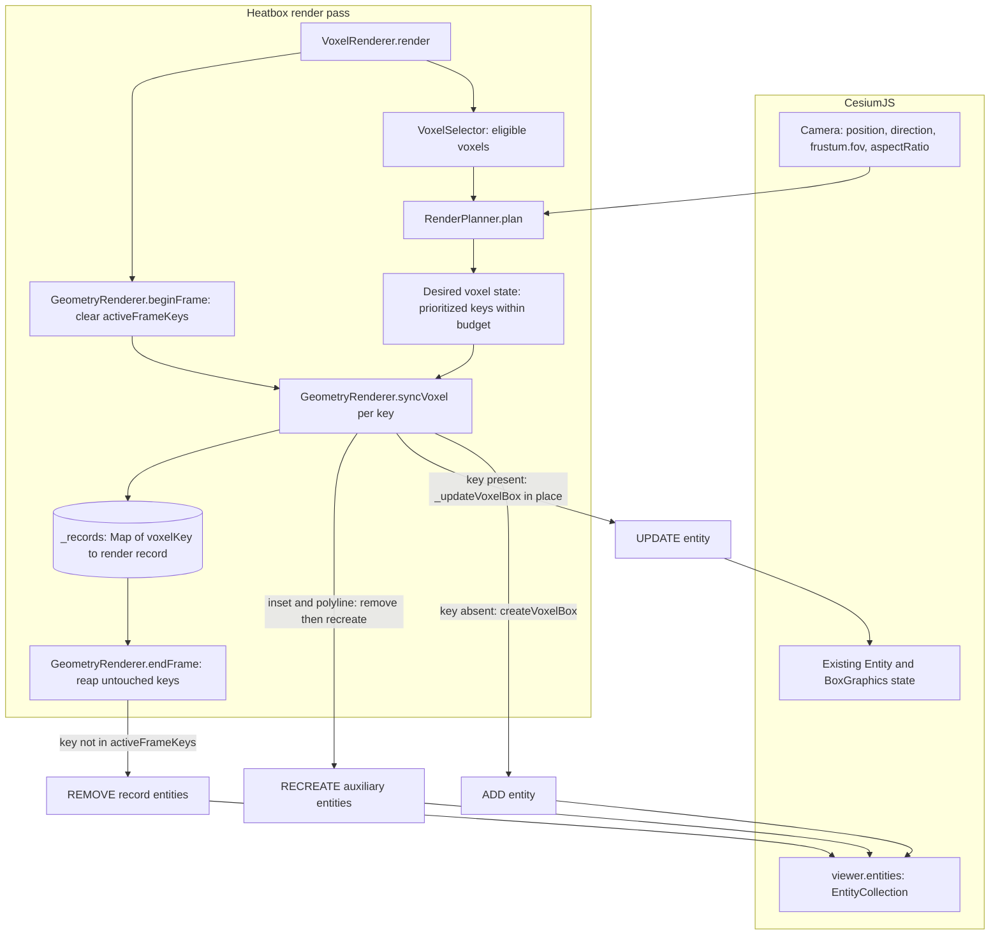
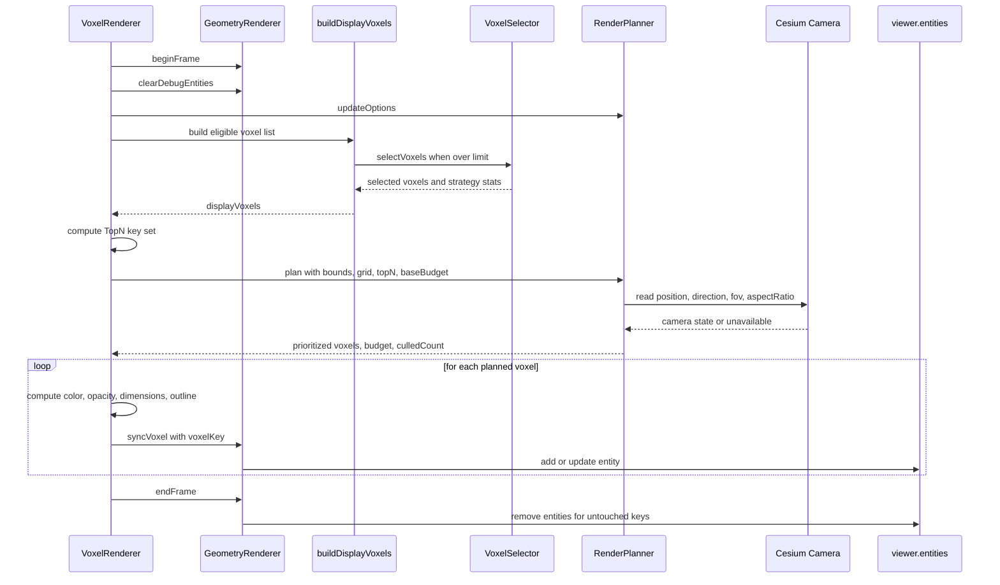

# ADR-0020: Incremental Entity Rendering and Camera-Aware Render Planning / 差分Entity描画とカメラ考慮の描画計画

**Status**: Accepted
**Decision date / 決定日**: 2026-04-06 (v1.3.0), refined 2026-04-07 (v1.3.4), correctness fix 2026-08-11 (v1.3.7-alpha)
**Recorded / 記録日**: 2026-08-23
**Author**: hiro-nyon
**Target Version**: v1.3.0
**Implementation State**: Implemented
**Related**: [ADR-0009](ADR-0009-voxel-renderer-responsibility-separation.md) (VoxelRenderer responsibility separation), [ADR-0019](ADR-0019-v1.3.7-current-runtime-architecture.md) (current runtime architecture), [ROADMAP v1.3.0](../../ROADMAP.md)
**Primary commits**: `9feb120` (v1.3.0 performance foundation), `6d669a9` (v1.3.4 camera-refresh and planner recovery fixes), `e093192` (v1.3.7-alpha thick-frame reclamation fix)

> **Retrospective record / 後追い記録である旨.** This ADR was **written on 2026-08-23**, after the fact. The initial decision and its first refinement shipped in v1.3.0–v1.3.4 (April 2026), with a later thick-frame reclamation correction in August 2026, but were never captured as an ADR at the time; this document reconstructs them from Git history, CHANGELOG, ROADMAP, and the source at `32bdfcd`. The `Decision date` field records that chronology, not when this file was authored.
>
> 本ADRは **2026-08-23 に後から作成した** 記録である。最初の決定と改良は v1.3.0〜v1.3.4（2026年4月）に実施され、太枠record回収の追加修正は2026年8月に行われたが、当時ADRとして記録されなかった。本文書は Git history、CHANGELOG、ROADMAP、および `32bdfcd` 時点のソースから再構成したものである。`Decision date` はこの経緯を示し、本ファイルの作成日ではない。

> **Language / 言語.** This ADR is bilingual: each English passage is followed by its Japanese counterpart. Mermaid node labels are kept in English for parse safety and legibility, with a Japanese reading note after each diagram.
>
> 本ADRは日英併記である。英語の各段落の直後に日本語を併記する。Mermaid の node label は parse 安全性と可読性のため英語のみとし、各図の直後に日本語の読み方注記を置く。

## Context / 背景

### The rendering path before v1.3.0 / v1.3.0 以前の描画経路

Up to and including v1.2.1, every render pass rebuilt the entire Cesium `EntityCollection` contribution from scratch. `VoxelRenderer.render()` opened with an unconditional teardown:

v1.2.1 までは、描画パスごとに Cesium `EntityCollection` への寄与全体をゼロから作り直していた。`VoxelRenderer.render()` は無条件の破棄処理から始まっていた。

```js
// src/core/VoxelRenderer.js, at 9feb120^
render(voxelData, bounds, grid, statistics) {
  // v0.1.11: GeometryRendererに委譲してエンティティクリア (ADR-0009 Phase 4)
  this.geometryRenderer.clear();
  ...
```

`GeometryRenderer` tracked its output as a single flat array with no stable identity per voxel:

`GeometryRenderer` は生成物を単一のフラット配列で保持しており、ボクセルごとの安定した識別子を持っていなかった。

```js
// src/core/geometry/GeometryRenderer.js, at 9feb120^
this.entities = [];
...
const entity = this.viewer.entities.add(entityConfig);
this.entities.push(entity);
...
clear() {
  this.entities.forEach(entity => { ... this.viewer.entities.remove(entity); });
  this.entities = [];
}
```

Because the array was keyed by nothing, there was no way to ask "does an entity for voxel `x,y,z` already exist, and is it still correct?" The only available operations were *add everything* and *remove everything*.

配列がキーを持たないため、「ボクセル `x,y,z` のエンティティは既に存在するか、そしてそれは今も正しいか」を問う手段がなかった。可能な操作は *全追加* と *全削除* だけだった。

### Why this became a problem / なぜこれが問題になったか

Three consequences follow from clear-and-recreate, and all three are recorded in project history rather than inferred:

clear-and-recreate 方式からは3つの帰結が生じる。いずれも推測ではなくプロジェクト履歴に記録されている事実である。

1. **Heap growth across render/clear cycles.** The v1.3.0 ROADMAP entry sets an explicit goal of "大規模データ時のヒープ増分最適化（レンダ/クリア反復での増分 ≤ 20MB 目安）" — bounding heap growth over repeated render/clear iterations. The v1.3.0 CHANGELOG records the fix as "レンダ/クリア反復時の不要なエンティティ再生成を抑制し、ヒープ増分の回帰を起こしにくい構成へ修正".
   **描画/クリア反復にわたるヒープ増加。** ROADMAP v1.3.0 は「レンダ/クリア反復での増分 ≤ 20MB 目安」を明示的な目標として掲げ、CHANGELOG v1.3.0 は修正内容を「不要なエンティティ再生成の抑制」と記録している。
2. **Unnecessary mutation of the `EntityCollection`.** A pass that changed one voxel's colour still removed and re-added every entity. With outline emulation enabled a single voxel can expand to more than ten auxiliary entities, so the churn scales with the emulation configuration and not with the size of the actual change.
   **`EntityCollection` の不要な変更。** 1ボクセルの色だけが変わる描画パスでも全エンティティを削除・再追加していた。枠線エミュレーション有効時は1ボクセルが10個超の補助エンティティに展開されるため、変更量ではなくエミュレーション設定に比例して churn が増大する。
3. **Camera-insensitive work with a non-adaptive budget.** Selection (`VoxelSelector`) chose *which* voxels were eligible, but nothing reduced the set based on what the camera could actually see, and nothing prioritised near voxels over far ones. Entity creation was bounded by the static `maxRenderVoxels` option, while candidate traversal still scaled with the input; neither adjusted to viewing conditions.
   **カメラを考慮しない作業と非適応的な予算。** `VoxelSelector` は描画*対象候補*を選ぶが、カメラから実際に見えるかどうかで絞り込む機構はなく、近いボクセルを優先する機構もなかった。Entity生成数は静的な `maxRenderVoxels` に制限される一方、候補走査は入力規模に応じて増加し、いずれも視点条件には適応しなかった。

A note on what is **not** claimed here: the project history documents heap growth and redundant entity re-creation. It does **not** contain a recorded reproduction of visual flicker or render instability attributable to clear-and-recreate. That failure mode is plausible for this pattern but is not evidenced in this repository, so it is not offered as motivation.

**ここで主張していないこと。** プロジェクト履歴に記録されているのはヒープ増加と冗長なエンティティ再生成である。clear-and-recreate に起因する視覚的なちらつきや描画の不安定性については、再現記録が存在しない。このパターンで起こり得る事象ではあるが、本リポジトリに証拠がないため動機として提示しない。

### Constraints carried into the decision / 決定時に引き継いだ制約

- The public API had to remain unchanged. v1.3.0 is documented as "互換性: 変更なし（内部最適化）".
  公開APIは変更不可。v1.3.0 は「互換性: 変更なし（内部最適化）」として文書化されている。
- The renderer backend remains Cesium **Entity**-based (`viewer.entities`, `BoxGraphics`, `PolylineGraphics`). Moving to `Primitive`/`GeometryInstance` was not in scope and remains unimplemented.
  描画backendは Cesium **Entity** 方式のまま（`viewer.entities`、`BoxGraphics`、`PolylineGraphics`）。`Primitive`/`GeometryInstance` への移行は対象外であり、現在も未実装。
- The component boundaries established by ADR-0009 had to be respected: Cesium-touching code stays in the geometry layer, and planning/selection logic must not reach back into the orchestrator.
  ADR-0009 が定めたコンポーネント境界を維持すること。Cesium に触れるコードは geometry 層に留め、計画/選択ロジックはオーケストレータを逆参照しない。

## Decision / 決定事項

### 1. Keyed render records replace the flat entity array / キー付き render record によるフラット配列の置き換え

`GeometryRenderer` owns a map from voxel key to a *render record* — the set of Cesium entities that together represent one voxel:

`GeometryRenderer` は voxel key から *render record*（1ボクセルを構成する Cesium エンティティの集合）へのマップを保持する。

```js
// src/core/geometry/GeometryRenderer.js
this._records = new Map();        // voxelKey -> record
this._activeFrameKeys = new Set();
this._debugEntities = [];
```

A record is `{ key, boxEntity, insetEntity, frameEntities, polylineEntities }`. The voxel key is the same identity used by the data layer: `"x,y,z"` from `VoxelGrid.getVoxelKey()` in regular-grid mode, or the Spatial ID `zfxyStr` (`"/z/f/x/y"`) in Spatial ID mode. Render identity is therefore inherited from the data model rather than invented by the renderer.

record は `{ key, boxEntity, insetEntity, frameEntities, polylineEntities }` である。voxel key はデータ層と同一の識別子を使う — 一様グリッドモードでは `VoxelGrid.getVoxelKey()` による `"x,y,z"`、Spatial ID モードでは `zfxyStr`（`"/z/f/x/y"`）。描画側の識別子はレンダラが独自に発明したものではなく、データモデルから継承している。

### 2. An explicit frame protocol: `beginFrame` / `syncVoxel` / `endFrame` / 明示的なフレームプロトコル

The renderer no longer exposes "create" and "clear" as its only verbs. It exposes a three-phase frame:

レンダラの操作は「生成」と「クリア」だけではなくなり、3フェーズのフレームを公開する。

```js
beginFrame() {                       // start a diff frame
  this._activeFrameKeys.clear();
}

syncVoxel(config) {                  // upsert one voxel, by key
  const { voxelKey } = config;
  this._activeFrameKeys.add(voxelKey);
  const record = this._records.get(voxelKey) || { /* empty record */ };
  if (!record.boxEntity) {
    record.boxEntity = this.createVoxelBox(config);   // ADD
  } else {
    this._updateVoxelBox(record.boxEntity, config);   // UPDATE in place
  }
  this._syncInsetRecord(record, config);
  this._syncPolylineRecord(record, config);
  this._records.set(voxelKey, record);
}

endFrame() {                         // reap keys not touched this frame
  for (const key of this._records.keys()) {
    if (!this._activeFrameKeys.has(key)) {
      this._removeRecord(key);                        // REMOVE
    }
  }
  this._rebuildEntitiesCache();
}
```

`_updateVoxelBox` mutates the existing `Cesium.Entity` in place — `position`, `box.dimensions`, `box.material`, `box.outline*`, `box.fill`, `entity.properties.*`, and `entity.description` — instead of removing and re-adding it. The entity's identity within `viewer.entities` survives the update, which is what makes the operation an update rather than a replacement.

`_updateVoxelBox` は既存の `Cesium.Entity` を削除・再追加せず、その場で書き換える（`position`、`box.dimensions`、`box.material`、`box.outline*`、`box.fill`、`entity.properties.*`、`entity.description`）。`viewer.entities` 内でのエンティティ同一性が更新後も保たれる点が、この操作を「置換」ではなく「更新」にしている。

### 3. Honest scope of the incremental path / 差分更新の適用範囲（正確な記述）

The add/update/remove lifecycle applies fully to the **primary box entity**. It does **not** yet apply to the auxiliary outline geometry:

add/update/remove のライフサイクルが完全に適用されるのは **主たる box entity** である。補助的な枠線ジオメトリには **まだ適用されていない**。

- `_syncInsetRecord` removes the existing inset entity and its thick-frame entities and recreates them whenever an inset outline is shown.
  `_syncInsetRecord` はインセット枠線を表示するたび、既存のインセットエンティティと太枠エンティティを削除して再生成する。
- `_syncPolylineRecord` removes and recreates the twelve edge polylines whenever thick-outline emulation is active.
  `_syncPolylineRecord` は太線エミュレーションが有効なとき、12本のエッジポリラインを削除して再生成する。

So a configuration using `outlineRenderMode: 'standard'` without emulation gets a genuinely incremental frame; a configuration using inset outlines or emulation still recreates its auxiliary entities each pass, while the box entities are still reused. Narrowing that gap is open work, deliberately recorded here rather than glossed over.

したがって、エミュレーションなしの `outlineRenderMode: 'standard'` 構成では真に差分的なフレームになるが、インセット枠線やエミュレーションを使う構成ではパスごとに補助エンティティが再生成される（box entity は再利用される）。この差の解消は未着手の課題であり、曖昧にせず意図的に記録しておく。

### 4. `RenderPlanner` is a separate component from selection and from mutation / 選択とも変更とも分離した独立コンポーネント

A new module, `src/core/render/RenderPlanner.js`, sits between voxel selection and Cesium mutation. Its single entry point is pure with respect to Cesium state — it reads the camera and returns a plan; it never touches `viewer.entities`:

新規モジュール `src/core/render/RenderPlanner.js` は、ボクセル選択と Cesium 変更操作の間に位置する。単一のエントリポイントは Cesium 状態に対して純粋である — カメラを読んで計画を返すだけで、`viewer.entities` には一切触れない。

```js
plan(voxels, bounds, grid, topNVoxels, baseBudget)
  -> { voxels: Array, budget: number, culledCount: number }
```

This yields a three-way split of responsibility inside the render pass:

これにより描画パス内部の責務が3分割される。

| Component | Question it answers / 答える問い | Cesium coupling / Cesium結合 |
|---|---|---|
| `VoxelSelector` (ADR-0009) | Which voxels are *eligible*, given a limit and a strategy?<br>上限と戦略のもとで、どのボクセルが*候補*か | None — Cesium-free; stateful statistics/logging<br>なし（Cesium非依存、統計／logのstateあり） |
| `RenderPlanner` (this ADR) | Of the eligible voxels, which should be drawn *now*, in what order, and how many?<br>候補のうち、*今*どれをどの順序で何個描くか | Reads `viewer.camera`, `viewer.scene.canvas`; uses `Cesium.Cartesian3`<br>カメラとcanvasを読む。`Cartesian3` を使用 |
| `GeometryRenderer` (ADR-0009) | How is the desired state realised as Cesium entities?<br>目標状態を Cesium エンティティとしてどう実現するか | Owns all `viewer.entities` add/remove for voxels. `VoxelRenderer.setVisible` separately toggles `show` on entities it created<br>ボクセルの追加/削除を全面的に所有。ただし `VoxelRenderer.setVisible` は生成済みエンティティの `show` を直接切り替える |

`VoxelRenderer` remains the orchestrator, calling them in that order. The important property is that **planning and mutation are separable**: the planner produces a desired voxel set as plain data, and the geometry layer diffs that desired set against what already exists.

`VoxelRenderer` はオーケストレータのまま、この順序で各コンポーネントを呼ぶ。重要な性質は **計画と変更操作が分離可能である** ことだ。planner は目標ボクセル集合をプレーンなデータとして生成し、geometry 層はその目標集合を既存状態と差分比較する。

### 5. Camera-aware planning / カメラを考慮した描画計画

`RenderPlanner` implements three camera-aware mechanisms. Each is listed here with the camera state it consumes, so the claim can be checked.

`RenderPlanner` は3種類のカメラ考慮mechanismを実装する。検証可能なように、それぞれが消費するcamera stateとともに示す。

**(a) Priority ordering — `_scoreVoxel`.** Voxels are sorted by a composite score:

**(a) 優先順位付け — `_scoreVoxel`。** ボクセルは合成スコアでソートされる。

```
score = (isTopN ? 1_000_000 : 0) + (count * 1_000) + proximityBonus
```

with ties broken by raw `count`. The proximity bonus is `max(0, 100_000 - distance)` where `distance` is computed from `camera.positionCartographic` to an estimated voxel centre using a local metres-per-degree approximation. This is an additive score, not a general lexicographic comparator. In the normal `VoxelRenderer` path, `topNVoxels` is constructed from the highest-count voxels, so the upstream invariant plus the `1_000_000` bonus keeps TopN members ahead of non-members. Within the same membership group, however, proximity can outweigh density differences of up to 99 counts; it is not limited to equal-density ties.

同点は生の `count` で決着する。近接ボーナスは `max(0, 100_000 - distance)` で、`distance` は `camera.positionCartographic` から推定ボクセル中心までを局所的な「度→メートル」近似で算出する。これは一般的な辞書式比較ではなく加算スコアである。通常の `VoxelRenderer` 経路では `topNVoxels` がcount上位から作られるため、その上流不変条件と `1_000_000` bonusの組合せでTopN memberがnon-memberより先になる。一方、同じmembership group内では近接度が最大99 count分の密度差を逆転でき、同密度間だけに作用するわけではない。

**(b) Height-dependent budget — `_resolveDynamicBudget`.** The camera's ellipsoid height is normalised against the scene's own scale, `max(referenceSize * 50, altitudeRange * 2, 1)`, where `referenceSize` is the largest of the grid's cell dimensions. The normalised height selects a step ratio:

**(b) 高度依存の描画予算 — `_resolveDynamicBudget`。** カメラの楕円体高をシーン自身のスケール `max(referenceSize * 50, altitudeRange * 2, 1)` で正規化する（`referenceSize` はグリッドのセル寸法の最大値）。正規化高度が段階比率を選ぶ。

| Normalised camera height / 正規化カメラ高度 | Budget ratio / 予算比率 |
|---|---|
| `> 80` | 0.45 |
| `> 40` | 0.65 |
| `> 20` | 0.80 |
| otherwise / それ以外 | 1.00 |

The result is clamped so it can never exceed the incoming base budget or the number of visible voxels: `min(baseBudget, floor(baseBudget * ratio), visibleCount)`. If `camera.positionCartographic` is missing, `camera.frustum.fov` is not finite, or the height is not positive, the planner falls back to `min(baseBudget, visibleCount)` and applies no scaling.

結果は基準予算と可視ボクセル数を超えないようクランプされる（`min(baseBudget, floor(baseBudget * ratio), visibleCount)`）。`camera.positionCartographic` が無い、`camera.frustum.fov` が有限でない、または高度が正でない場合、planner は `min(baseBudget, visibleCount)` にフォールバックしスケーリングを行わない。

**(c) Angular visibility filter — `_cullByViewport`.** For each voxel the planner computes the unit vector from `camera.position` to the estimated voxel centre and takes its dot product with `camera.direction`. Voxels with a non-positive dot product — behind the camera — are dropped. The remaining voxels are kept if the angle to the view direction is within an ad-hoc allowance derived from the field of view and aspect ratio:

**(c) 角度による可視性フィルタ — `_cullByViewport`。** 各ボクセルについて `camera.position` から推定中心への単位ベクトルを求め、`camera.direction` との内積を取る。内積が非正のボクセル（カメラ背面）は除外する。残りは、視線方向との角度が視野角とアスペクト比から導いたad-hocな許容範囲内であれば保持する。

```js
const halfFov = Math.max(0.15, fov / 2);
const horizontalAllowance = Math.atan(Math.tan(halfFov) * Math.max(aspectRatio, 1));
```

`aspectRatio` comes from `camera.frustum.aspectRatio`, falling back to the canvas client dimensions. Cesium defines `PerspectiveFrustum.fov` as horizontal when width exceeds height and vertical otherwise; this implementation always applies aspect-ratio expansion, so `horizontalAllowance` is a heuristic cone angle rather than the true horizontal half-FOV. If camera position, direction, FOV, or canvas is unavailable, the filter is skipped entirely and all voxels are returned — the planner degrades to a no-op rather than hiding data.

`aspectRatio` は `camera.frustum.aspectRatio` から取得し、無ければ canvas の client 寸法にフォールバックする。Cesiumの `PerspectiveFrustum.fov` はwidth > heightなら水平、そうでなければ垂直だが、本実装は常にaspect-ratio拡張を適用する。そのため `horizontalAllowance` は真の水平半FOVではなくヒューリスティックな円錐角である。カメラ位置・方向・FOV・canvas のいずれかが取得できない場合、フィルタは完全にスキップされ全ボクセルが返る — planner はデータを隠すのではなく no-op に退避する。

The estimated voxel centre is converted to world/ECEF coordinates with `Cartesian3.fromDegrees`, while the camera side reads `camera.position` and `camera.direction` rather than Cesium's explicit world-coordinate `positionWC` and `directionWC`. The comparison therefore assumes those values share a frame, as in the default 3D identity-transform case; non-identity camera transforms and other scene modes are not verified.

推定voxel中心は `Cartesian3.fromDegrees` でworld/ECEF座標へ変換する一方、camera側はCesiumの明示的なworld座標 `positionWC`／`directionWC` ではなく `camera.position`／`camera.direction` を読む。そのため既定3D identity-transform caseのように同じframeを共有することを仮定しており、non-identity camera transformや他scene modeは検証されていない。

### 6. Voxel centre estimation is source-dependent / ボクセル中心推定はデータ由来に依存する

`_estimateCenter` prefers real geometry when the data layer supplies it:

`_estimateCenter` はデータ層が実ジオメトリを供給している場合はそれを優先する。

- **Spatial ID mode**: the voxel record carries `bounds`, the eight corner vertices from the provider, and the centre is their arithmetic mean.
  **Spatial ID モード**: voxel record が provider 由来の8頂点 `bounds` を持つため、中心はその算術平均。
- **Regular-grid mode**: no per-voxel geometry exists, so the centre is interpolated linearly in degrees across the data bounds from the voxel's `x, y, z` indices.
  **一様グリッドモード**: ボクセル個別のジオメトリが存在しないため、`x, y, z` インデックスからデータ境界内を度単位で線形補間して中心を求める。

The regular-grid case is an approximation in the same family as the grid construction itself, which converts degrees to metres with a flat-earth `cos(centreLatitude)` factor. Planning accuracy inherits that approximation.

一様グリッドの場合は、グリッド構築自体（`cos(centreLatitude)` による平面近似での度→メートル変換）と同種の近似である。描画計画の精度はその近似を継承する。

### 7. Compact voxel records in the data layer / データ層のコンパクトな voxel record

As part of the same change, `DataProcessor` stopped retaining the source entity array on each voxel record. Voxel records are now `{ x, y, z, count }` plus optional `layerStats` / `layerTop` / `spatialId` / `bounds`. This is the data-layer half of the memory goal: the render path no longer holds references to the caller's `Cesium.Entity` objects after aggregation.

同じ変更の一部として、`DataProcessor` は各 voxel record に元エンティティ配列を保持することをやめた。現在の voxel record は `{ x, y, z, count }` と、任意の `layerStats` / `layerTop` / `spatialId` / `bounds` である。これはメモリ目標のデータ層側の半分にあたる — 集約後、描画経路は呼び出し側の `Cesium.Entity` への参照を保持しない。

## Explicit limitation: what this is not / 明示的な限界: これは何ではないか

This is stated in the ADR body because the surrounding project documents are more generous than the code. The v1.3.0 ROADMAP entry marks "動的LoD（Level of Detail）" and "ビューポートカリング最適化" as complete, which overstates what was built.

この節を ADR 本文に置く理由は、周辺のプロジェクト文書がコードより寛大な表現をしているためである。ROADMAP v1.3.0 は「動的LoD（Level of Detail）」と「ビューポートカリング最適化」を完了として `[x]` にしているが、これは実装内容を過大に表現している。

| Not implemented / 未実装 | What exists instead / 実際にあるもの |
|---|---|
| Frustum-plane culling<br>視錐台平面カリング | A single angular cone test against `camera.direction`, using a heuristic angle derived from `frustum.fov` and aspect ratio. There are no near/far plane tests and no separate vertical bound.<br>`camera.direction` に対する単一の円錐角度判定（`frustum.fov` とaspect ratio由来のヒューリスティック角）。near/far 平面判定も独立した垂直方向の境界も無い |
| Terrain occlusion culling<br>地形による遮蔽カリング | None. Voxels behind terrain are planned and drawn.<br>無し。地形背後のボクセルも計画され描画される |
| GPU or depth-buffer occlusion queries<br>GPU/深度バッファ遮蔽クエリ | None.<br>無し |
| A level-of-detail system<br>LoD システム | A four-step budget ratio keyed on normalised camera height. No geometry simplification, no voxel merging, no per-voxel LoD levels, no hysteresis.<br>正規化カメラ高度に基づく4段階の予算比率のみ。ジオメトリ簡略化、ボクセル統合、ボクセル単位のLoD段階、ヒステリシスはいずれも無い |
| Screen-space error metrics<br>スクリーン空間誤差指標 | None.<br>無し |
| `requestRenderMode` integration<br>`requestRenderMode` 対応 | None. `scene.requestRender()` is not called anywhere in `src/`.<br>無し。`src/` のどこからも `scene.requestRender()` を呼んでいない |
| A `Primitive` / `GeometryInstance` backend<br>`Primitive`/`GeometryInstance` backend | Output remains Cesium `Entity` objects with `BoxGraphics` and `PolylineGraphics`.<br>出力は `BoxGraphics`/`PolylineGraphics` を持つ Cesium `Entity` のまま |

The correct description of the mechanism is **camera-aware prioritisation with a heuristic circular angular filter and a height-scaled budget**. It evaluates each voxel's estimated centre rather than its bounding volume. It can retain off-screen geometry and can also drop geometry whose box intersects the real rectangular frustum while its centre or a visible corner lies outside the circular cone. It reduces work under common viewing conditions; it does not compute exact visibility.

この機構の正確な記述は **ヒューリスティックな円形角度フィルタと高度スケール予算を伴うカメラ考慮の優先順位付け** である。voxel bounding volumeではなく推定中心だけを判定するため、画面外geometryを残す場合と、boxが実際の矩形frustumと交差していても中心または可視cornerが円錐外として落ちる場合の両方がある。一般的な視点条件下で作業量を削減するが、正確な可視性を計算するものではない。

## Consequences / 影響

### Benefits / 利点

- A render pass that changes only voxel values mutates existing box entities rather than replacing the collection, removing one documented source of heap growth across repeated render/clear cycles. The repository contains no allocation profile proving it was the dominant source.
  ボクセル値のみが変わる描画パスは、コレクションを置換せず既存 box entity を書き換える。描画/クリア反復におけるヒープ増加について記録された要因の1つを除去するが、それが主要因だったと証明するallocation profileはリポジトリに存在しない。
- Render identity is stable and inspectable. `entity.properties.key` matches the data-layer voxel key, which is what makes click-picking resolve back to a voxel.
  描画側の識別子が安定し検査可能になった。`entity.properties.key` がデータ層の voxel key と一致するため、クリック picking からボクセルへ逆解決できる。
- Planning is testable without Cesium rendering. `RenderPlanner` takes a viewer-shaped object and returns plain data, so its heuristics are unit-tested directly (`test/core/render/RenderPlanner.test.js` covers behind-camera filtering, budget reduction at high altitude, and the guarantee that the budget is never raised above a small `maxRenderVoxels`). These tests use the repository Cesium mock, whose `Cartesian3.fromDegrees` does not perform real ECEF conversion; they do not validate real frustum geometry or camera reference frames.
  Cesium描画なしで計画をテストできる。`RenderPlanner` はviewer形状のobjectを受けてplain dataを返すため、ヒューリスティックを直接unit testできる（`test/core/render/RenderPlanner.test.js` がカメラ背面filter、高高度での予算縮小、小さい `maxRenderVoxels` を超えて予算が増えないことを検証）。ただしこれらはrepositoryのCesium mockを使用し、その `Cartesian3.fromDegrees` は実ECEF変換を行わないため、実frustum geometryやcamera reference frameは検証しない。
- The diff protocol is verified rather than assumed: `test/core/geometry/GeometryRenderer.test.js` asserts that an unchanged box entity is not recreated across passes, that stale records are removed at `endFrame`, and that thick-frame entities are tracked and removed across diff updates.
  差分プロトコルは仮定ではなく検証済みである。`test/core/geometry/GeometryRenderer.test.js` が「変化のない box entity がパス間で再生成されないこと」「`endFrame` で不要 record が削除されること」「太枠エンティティが差分更新をまたいで追跡・削除されること」を検証している。
- Camera-aware budgeting gives high-altitude views a smaller entity budget without the caller having to retune `maxRenderVoxels` per viewpoint. FOV and aspect ratio affect the angular filter, not the budget ratio.
  カメラ考慮の予算制御により、高高度viewでは呼び出し側が視点ごとに `maxRenderVoxels` を調整しなくてもentity予算が小さくなる。FOVとaspect ratioが影響するのは角度filterでありbudget ratioではない。

### Trade-offs / トレードオフ

- **Two sources of truth about "what is drawn".** The planner's output and the geometry layer's record map must agree. A voxel dropped by the planner is reaped by `endFrame`, so a planner bug now manifests as disappearing geometry. This was the actual failure observed in v1.3.4: after a camera move, temporal examples could be left with an empty scene because the previously rendered set was culled and nothing re-rendered it. The fix (`6d669a9`) added camera-triggered refresh on the temporal path — see ADR-0021.
  **「何が描かれているか」の真実の源が2つある。** planner の出力と geometry 層の record map が一致していなければならない。planner が落としたボクセルは `endFrame` で回収されるため、planner のバグはジオメトリの消失として現れる。これは v1.3.4 で実際に観測された障害である — カメラ移動後、既描画集合が culling され再描画されないため temporal example が空表示のまま残った。修正（`6d669a9`）は時系列経路にカメラ起点の再描画を追加した（ADR-0021 参照）。
- **The heuristics are opaque to callers.** The budget ratios and the `100_000`/`1_000`/`1_000_000` scoring weights are compiled-in constants with no public configuration surface. Tuning them requires a library change.
  **ヒューリスティックが呼び出し側から不透明。** 予算比率と `100_000`/`1_000`/`1_000_000` のスコア重みは組み込み定数で、公開設定面を持たない。調整にはライブラリ側の変更が必要。
- **State that must be reset.** `_records` and `_activeFrameKeys` are long-lived, so `clear()` must drop both, and any path that bypasses `endFrame` leaks records. Entity removal is wrapped in try/catch with a destroyed-entity check because record contents can outlive the viewer's own state.
  **リセットが必要な状態。** `_records` と `_activeFrameKeys` は長寿命であり、`clear()` は両方を破棄しなければならない。`endFrame` を経由しない経路は record をリークさせる。record の内容が viewer 自身の状態より長生きし得るため、エンティティ削除は破棄済み判定つきの try/catch で包んでいる。
- **Partial incrementality is a correctness-neutral but performance-relevant asymmetry.** Users of inset or emulated outlines get less benefit than the CHANGELOG's "差分更新型" phrasing suggests.
  **部分的な差分化は、正しさには中立だが性能には影響する非対称性である。** インセット枠線やエミュレーションの利用者が得る恩恵は、CHANGELOG の「差分更新型」という表現が示唆するほど大きくない。
- **Approximate planning in regular-grid mode.** Voxel centres are interpolated in degrees, so priority and culling decisions carry the same distortion as the grid's flat-earth metre conversion, growing with area and latitude.
  **一様グリッドモードでは計画が近似的。** ボクセル中心を度単位で補間するため、優先度と culling の判断はグリッドの平面近似と同じ歪みを持ち、範囲と緯度が大きくなるほど拡大する。
- **More moving parts under `VoxelRenderer`.** ADR-0009 aimed to shrink the orchestrator; this ADR adds a component to orchestrate. `VoxelRenderer.js` is 802 lines, still well above ADR-0009's 300-line target.
  **`VoxelRenderer` 配下の構成要素が増えた。** ADR-0009 はオーケストレータの縮小を目指したが、本ADRは統括対象を1つ増やしている。`VoxelRenderer.js` は802行で、ADR-0009 の300行目標を大きく上回っている。
- **TopN eligibility does not guarantee all TopN voxels are drawn.** The planner sorts TopN members first in the normal pipeline, but its height-scaled final budget can be smaller than `highlightTopN`, so only the first budgeted subset is rendered.
  **TopN候補性はTopN全件の描画を保証しない。** 通常経路ではplannerがTopN memberを先に並べるが、高度スケール後の最終budgetが `highlightTopN` より小さくなり得るため、budget内の先頭subsetだけが描画される。
- **Runtime selector options can stay stale.** `Heatbox.updateOptions()` forwards changes to `RenderPlanner`, `AdaptiveController`, and `GeometryRenderer`, but not to the existing `VoxelSelector`; selector-owned strategies and coverage settings require reconstruction to take effect.
  **runtime selector optionが古いまま残り得る。** `Heatbox.updateOptions()` は変更を `RenderPlanner`、`AdaptiveController`、`GeometryRenderer` へ渡すが、既存 `VoxelSelector` には渡さない。selector所有のstrategyやcoverage設定を反映するには再生成が必要である。

## Architecture / アーキテクチャ

### Render pass state transitions / 描画パスの状態遷移



Read the three `SYNC` edges as the per-key decision: a key seen for the first time is an EntityCollection membership ADD, a key already present is an in-place Entity/BoxGraphics state UPDATE, and inset/polyline geometry is recreated on both paths. `endFrame` turns *absence from the desired set* into removal of the whole voxel record. Auxiliary inset/polyline entities can also be removed and recreated during `syncVoxel`; `endFrame` is only the whole-record deletion path in a normal frame.

**日本語での読み方**: `SYNC` から出る3本の辺が key ごとの判断を表す。初出の key はEntityCollection membershipのADD、既存の key はEntity／BoxGraphics状態のその場UPDATE、インセット／ポリラインのジオメトリはどちらの経路でも再生成される。`endFrame` は *目標集合に存在しないこと* をvoxel record全体のREMOVEに変換する。補助的なinset/polyline entityは `syncVoxel` 中にも削除・再生成されるため、`endFrame` が唯一なのは通常フレームにおけるrecord全体の削除経路である。

### Call order inside `VoxelRenderer.render` / `VoxelRenderer.render` 内の呼び出し順序



**日本語での読み方**: 描画パスは固定順序で進む — 差分フレーム開始 → デバッグエンティティ削除 → planner オプション更新 → 候補ボクセル構築（上限超過時のみ `VoxelSelector` を呼ぶ）→ TopN キー集合の算出 → カメラ状態を読んで計画 → 計画されたボクセルごとに視覚パラメータを計算して `syncVoxel` → フレーム終了時に未使用キーのエンティティを削除。

## Alternatives considered / 検討した代替案

**A. Keep clear-and-recreate and reduce the render budget instead.** Cheapest change, no new components. Rejected: it treats the symptom. The cost is proportional to the drawn set on *every* pass regardless of how little changed, so a temporal use case updating at a few hertz still pays full teardown each time.

**A. clear-and-recreate を維持し、描画予算を下げるだけにする。** 最も安価で新規コンポーネント不要。却下理由: 症状の対処にすぎない。変更量に関係なく *毎パス* 描画集合に比例したコストがかかるため、数Hzで更新する時系列用途では毎回フル破棄のコストを払い続ける。

**B. Diff inside `VoxelRenderer` and keep `GeometryRenderer` create-only.** Would have preserved the ADR-0009 contract (`renderVoxel(...) => Entity[]`) exactly. Rejected: the orchestrator would then need to hold Cesium entity references and decide which properties are mutable, pulling Cesium coupling back into the layer ADR-0009 deliberately kept Cesium-free.

**B. 差分計算を `VoxelRenderer` 側で行い、`GeometryRenderer` は生成専用のままにする。** ADR-0009 の契約（`renderVoxel(...) => Entity[]`）を厳密に維持できた。却下理由: オーケストレータが Cesium エンティティ参照を保持し、どのプロパティが可変かを判断する必要が生じる。ADR-0009 が意図的に Cesium 非依存に保った層に Cesium 結合を引き戻すことになる。

**C. Fold planning into `VoxelSelector`.** One fewer component. Rejected: `VoxelSelector` is Cesium-free and directly testable without a viewer, although it is stateful rather than a pure function. Reading `viewer.camera` inside it would break the Cesium-free boundary and require a viewer mock. Keeping a separate Cesium-reading planner preserves the testable selection layer.

**C. 計画機能を `VoxelSelector` に統合する。** コンポーネントが1つ減る。却下理由: `VoxelSelector` はpure functionではなくstatefulだが、Cesium非依存でviewerなしに直接testできる。内部で `viewer.camera` を読めばCesium非依存境界が壊れ、viewer mockが必要になる。Cesiumを読むplannerを別に置くことでtest可能なselection層が保たれる。

**D. Implement real frustum-plane culling with `Cesium.CullingVolume`.** More accurate visibility. Not done in v1.3.0 — the angular test was chosen as a cheap first step. This remains a reasonable future change, and it is the honest reason the limitation section above exists. Note that per-voxel visibility would still need voxel geometry that regular-grid mode does not currently compute exactly.

**D. `Cesium.CullingVolume` による本物の視錐台平面カリングを実装する。** 可視性判定が正確になる。v1.3.0 では未実施 — 安価な第一歩として角度判定を選んだ。将来の妥当な変更候補であり、上記の限界節が存在する正直な理由でもある。なお、ボクセル単位の可視性判定には、一様グリッドモードが現在は正確に算出していないボクセルジオメトリが必要になる。

**E. Move to a `Primitive`/`GeometryInstance` backend.** Would change the performance envelope far more than diffing does. Out of scope and still unimplemented; the ROADMAP places an optional Primitive backend at v3.0. The project's earlier history includes a move *away* from a Primitive-based approach for Cesium version-compatibility reasons, so this is a revisit rather than a new idea.

**E. `Primitive`/`GeometryInstance` backend へ移行する。** 差分化よりはるかに大きく性能特性を変え得る。対象外であり現在も未実装。ROADMAP は optional Primitive backend を v3.0 に置いている。本プロジェクトの過去履歴には Cesium バージョン互換性の理由で Primitive 方式から *離れた* 経緯があるため、これは新規アイデアではなく再検討にあたる。

## Acceptance evidence / 受け入れ根拠

Verified at `32bdfcd` (v1.3.7), not at the time of the original decision:

`32bdfcd`（v1.3.7）時点で検証した内容である。当初の決定時点での検証ではない。

- `RenderPlanner` exists at `src/core/render/RenderPlanner.js` and is constructed by `VoxelRenderer`; `VoxelRenderer.render` calls `renderPlanner.plan(...)` between selection and per-voxel rendering.
  `RenderPlanner` は `src/core/render/RenderPlanner.js` に存在し、`VoxelRenderer` が生成する。`VoxelRenderer.render` は選択とボクセル単位描画の間で `renderPlanner.plan(...)` を呼ぶ。
- `GeometryRenderer` exposes `beginFrame`/`syncVoxel`/`endFrame` and keys records by voxel key; `_updateVoxelBox` mutates an existing entity rather than replacing it.
  `GeometryRenderer` は `beginFrame`/`syncVoxel`/`endFrame` を公開し、record を voxel key でキー付けする。`_updateVoxelBox` は既存エンティティを置換せず書き換える。
- `Heatbox.updateOptions` forwards option changes to `renderPlanner.updateOptions` alongside `adaptiveController` and `geometryRenderer`.
  `Heatbox.updateOptions` は `adaptiveController` と `geometryRenderer` に加えて `renderPlanner.updateOptions` にもオプション変更を伝播する。
- Public API is unchanged relative to v1.2.1 for these paths.
  これらの経路について公開APIは v1.2.1 から変更されていない。
- Default test suite passes at this commit: 41 suites, 513 passed, 1 skipped.
  このコミットで既定テストスイートが成功: 41 suites、513 passed、1 skipped。

Not verified, and therefore not claimed: any frame-rate figure, any maximum sustainable voxel or entity count, and any memory reduction ratio in a real browser. The repository's heap-related assertions run against a mocked Cesium in Jest and function as regression guards, not as performance measurements.

**検証しておらず、したがって主張しないこと**: フレームレートの数値、持続可能な最大ボクセル数/エンティティ数、実ブラウザでのメモリ削減率。本リポジトリのヒープ関連アサーションは Jest 上の mock Cesium に対して実行されており、性能測定ではなく回帰ガードとして機能している。

## Relationship to other ADRs / 他ADRとの関係

- **Extends ADR-0009.** The ADR-0009 component taxonomy (`ColorCalculator`, `VoxelSelector`, `AdaptiveController`, `GeometryRenderer`, orchestrating `VoxelRenderer`) is preserved. This ADR adds `RenderPlanner` — a Cesium-reading planner, a category ADR-0009 did not anticipate — and replaces ADR-0009's `renderVoxel(...) => Entity[]` contract with the frame protocol. See ADR-0009's Implementation Outcome section.
  **ADR-0009 を拡張する。** ADR-0009 のコンポーネント分類（`ColorCalculator`、`VoxelSelector`、`AdaptiveController`、`GeometryRenderer`、統括する `VoxelRenderer`）は維持されている。本ADRは `RenderPlanner`（Cesium を読む planner。ADR-0009 が想定していなかった区分）を追加し、ADR-0009 の `renderVoxel(...) => Entity[]` 契約をフレームプロトコルに置き換えた。ADR-0009 の Implementation Outcome 節を参照。
- **Consumed by ADR-0021.** The temporal pipeline drives this render path through `Heatbox.updateValues()`, and the camera-triggered refresh in ADR-0021 exists specifically because this ADR's culling can otherwise leave a stale empty view after a camera move.
  **ADR-0021 から利用される。** 時系列パイプラインは `Heatbox.updateValues()` を通じてこの描画経路を駆動する。ADR-0021 のカメラ起点の再描画は、本ADRの culling がカメラ移動後に空表示を残し得るという理由でまさに存在している。
- **Summarised by ADR-0019**, which maps the whole current runtime architecture and its CesiumJS integration boundaries.
  **ADR-0019 が要約する。** ADR-0019 は現行ランタイムアーキテクチャ全体と CesiumJS 統合境界を地図化している。
