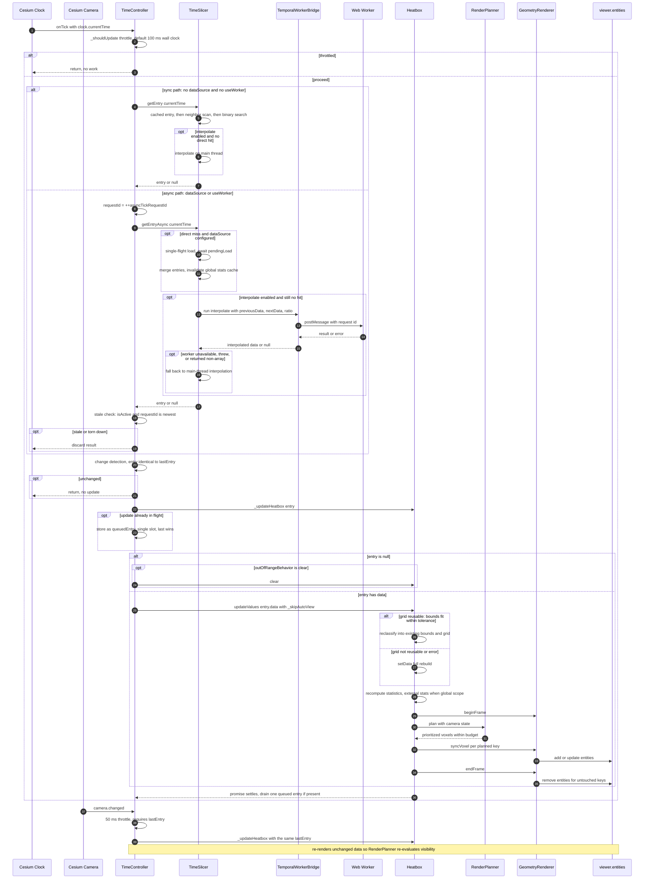
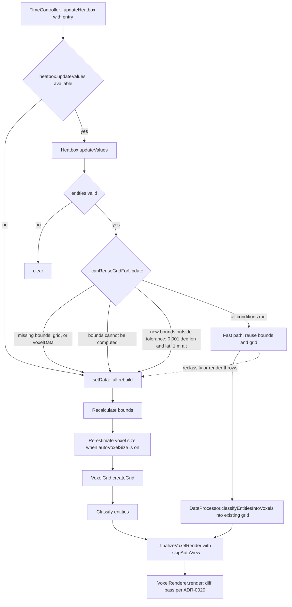

# ADR-0021: Asynchronous Temporal Data Pipeline and Lightweight Updates / 非同期時系列データパイプラインと軽量更新

**Status**: Accepted
**Decision date / 決定日**: 2026-04-06 (v1.3.1 / v1.3.2), refined 2026-04-07 (v1.3.4)
**Recorded / 記録日**: 2026-08-23
**Author**: hiro-nyon
**Target Version**: v1.3.1 – v1.3.4
**Implementation State**: Implemented
**Relationship**: **Extends ADR-0018** — does not supersede it / **ADR-0018 を拡張する**（supersede ではない）
**Related**: ADR-0018 (v1.2.0 temporal PoC), ADR-0020 (incremental rendering and camera-aware planning), ADR-0019 (current runtime architecture), ROADMAP v1.3.1 / v1.3.2
**Primary commits**: `eabfd9e` (v1.3.1 `updateValues` fast path), `86ef7f0` (v1.3.2 interpolation and worker support), `6d669a9` (v1.3.4 camera-triggered refresh, lazy-merge cache invalidation, conservative bounds reuse)

> **Retrospective record / 後追い記録である旨.** This ADR was **written on 2026-08-23**, after the fact. The decisions it records were taken and shipped in v1.3.1–v1.3.4 (April 2026) but were never captured as an ADR at the time; this document reconstructs them from Git history, CHANGELOG, ROADMAP, ADR-0018's own deferral statements, and the source at `32bdfcd`. The `Decision date` field is when the decisions were made, not when this file was authored.
>
> 本ADRは **2026-08-23 に後から作成した** 記録である。記録対象の決定は v1.3.1〜v1.3.4（2026年4月）に実施・リリースされたが、当時ADRとして記録されなかった。本文書は Git history、CHANGELOG、ROADMAP、ADR-0018 自身の先送り記述、および `32bdfcd` 時点のソースから再構成したものである。`Decision date` は決定時点を指し、本ファイルの作成日ではない。

> **Language / 言語.** This ADR is bilingual: each English passage is followed by its Japanese counterpart. Mermaid node labels are kept in English for parse safety and legibility, with a Japanese reading note after each diagram.
>
> 本ADRは日英併記である。英語の各段落の直後に日本語を併記する。Mermaid の node label は parse 安全性と可読性のため英語のみとし、各図の直後に日本語の読み方注記を置く。

## Why this extends ADR-0018 rather than superseding it / ADR-0018 を supersede せず extend とする理由

ADR-0018 established the temporal architecture that is still in force: `temporal` options, a `TimeController` bound to `viewer.clock.onTick`, and a `TimeSlicer` that resolves a `JulianDate` to a data slice. None of that was reversed. What changed is that four capabilities ADR-0018 **explicitly deferred** were subsequently built, and each was deferred to exactly the version that later delivered it. ADR-0018's own text is the evidence:

ADR-0018 が確立した時系列アーキテクチャは現在も有効である — `temporal` オプション群、`viewer.clock.onTick` に結線された `TimeController`、`JulianDate` をデータスライスへ解決する `TimeSlicer`。これらはいずれも撤回されていない。変わったのは、ADR-0018 が **明示的に先送りした** 4つの機能がその後実装されたことであり、しかも各項目は後に実際に提供したバージョンへ正確に先送りされていた。根拠は ADR-0018 自身の記述である。

| ADR-0018 text / ADR-0018 の記述 | Where it landed / 実装先 |
|---|---|
| "**Out of Scope**: データの補間（Interpolation）: v1.3.0" | `temporal.interpolate`, v1.3.2 (`86ef7f0`) |
| "**Out of Scope**: 遅延ロード（Lazy Loading）: v1.3.0" | `temporal.dataSource`, v1.3.2 (`86ef7f0`) |
| Alternative 2, WebWorker: "v1.2.0 では見送り、v1.3.0 以降でオプション機能として検討。`temporal.useWorker: true` のような設定で有効化" | `temporal.useWorker`, v1.3.2 (`86ef7f0`) — including the option name / オプション名まで一致 |
| Alternative 4, lightening `setData()`: "v1.2.0 では内部実装として `options._skipRebuild` を導入するが、公開APIとしては提供しない。v1.3.0 で `heatbox.updateValues(data)` として検討" | `Heatbox.updateValues()`, v1.3.1 (`eabfd9e`) — including the method name / メソッド名まで一致 |

Two alternatives ADR-0018 *rejected* were therefore later adopted, on the schedule ADR-0018 predicted. That is an evolution of a decision, not a reversal of one, so ADR-0018 remains `Accepted` and this ADR records the additions. ADR-0018's Alternative 3 (3D Tiles integration) was deferred to v2.0 and remains unimplemented.

すなわち ADR-0018 が *却下した* 代替案2件が、ADR-0018 自身が予告した時期に採用された。これは決定の撤回ではなく発展であるため、ADR-0018 は `Accepted` のまま維持し、本ADRが追加分を記録する。ADR-0018 の Alternative 3（3D Tiles 統合）は v2.0 へ先送りされ、現在も未実装である。

## Context / 背景

### What the PoC left exposed / PoC が残した構造的な穴

The v1.2.0 pipeline was synchronous end to end. On each throttled clock tick, `TimeSlicer.getEntry(now)` performed a lookup over an in-memory, fully preloaded, non-overlapping array of slices, and the result was pushed into `Heatbox.setData()`. Three structural gaps follow:

v1.2.0 のパイプラインは端から端まで同期的だった。throttle された clock tick ごとに `TimeSlicer.getEntry(now)` が、完全に事前ロードされ重複解消済みのメモリ内スライス配列を検索し、結果を `Heatbox.setData()` に渡していた。ここから3つの構造的な穴が生じる。

1. **Whole dataset resident up front.** `TimeSlicer` required a non-empty array in its constructor. A day of hourly slices had to be materialised before the first frame.
   **データセット全体を最初から常駐させる必要。** `TimeSlicer` はコンストラクタで非空配列を要求する。1日分の毎時スライスを初回フレーム前に実体化しなければならない。
2. **Gaps rendered as nothing.** If no slice covered the current time, the result was `null`, and `outOfRangeBehavior` decided between holding the previous view and clearing it. There was no way to show a value between two slices.
   **ギャップは何も描かれない。** 現在時刻をカバーするスライスが無ければ結果は `null` となり、`outOfRangeBehavior` が「前の表示を保持」か「クリア」かを決める。2つのスライスの間の値を表示する手段は存在しなかった。
3. **Full rebuild per update.** `setData()` recomputes bounds, re-estimates voxel size when `autoVoxelSize` is on, rebuilds the grid, reclassifies, recomputes statistics, and renders. For a playing clock that is a lot of work to repeat when only the values changed.
   **更新ごとの完全再構築。** `setData()` は境界を再計算し、`autoVoxelSize` 有効時はボクセルサイズを再推定し、グリッドを再構築し、再分類し、統計を再計算して描画する。再生中の clock に対して、値だけが変わる場合には過大な反復作業である。

Introducing asynchrony to fix (1) and (2) creates a problem the synchronous design did not have: **a tick's work can now outlive the tick**. Clock ticks arrive faster than a lazy load or a worker round-trip completes, so results can return out of order, return after the controller has been torn down, or pile up. The concurrency mechanisms in this ADR exist because of that, not for their own sake.

(1) と (2) を解決するために非同期性を導入すると、同期設計には無かった問題が生じる — **tick の処理が tick より長生きし得る**。clock tick は lazy load や worker の往復より速く到着するため、結果が順序を乱して返る、コントローラ破棄後に返る、あるいは積み上がる、という事態が起きる。本ADRの並行制御機構は、それ自体が目的ではなくこの理由で存在する。

### One more problem, found after shipping / リリース後に判明した追加の問題

v1.3.4 (`6d669a9`) recorded a failure specific to the interaction with ADR-0020: after a camera move, temporal examples could be left with an empty view. The camera-aware filter in `RenderPlanner` had culled the rendered set, and because no clock tick had produced a *new* slice, nothing re-rendered it — the identity check `entry === this._lastEntry` correctly suppressed a redundant update, and the result was a correctly-suppressed update of a view that needed one. The fix couples camera events to the temporal path.

v1.3.4（`6d669a9`）は ADR-0020 との相互作用に固有の障害を記録している — カメラ移動後、temporal example が空表示のまま残ることがあった。`RenderPlanner` のカメラ考慮フィルタが既描画集合を culling し、かつ clock tick が *新しい* スライスを生成しなかったため、再描画が起きなかった。同一性判定 `entry === this._lastEntry` は冗長な更新を正しく抑制したのだが、その結果として、更新を必要としていた表示に対する更新が正しく抑制されてしまった。修正はカメライベントを時系列経路に結線するものである。

## Decision / 決定事項

### 1. Component responsibilities / コンポーネントの責務

| Component | Responsibility / 責務 | Cesium coupling / Cesium結合 |
|---|---|---|
| `TimeController` | Owns the Cesium event subscriptions, throttling, change detection, staleness rejection, coalescing, and the choice of update method. Decides *when* to update.<br>Cesium イベント購読、throttle、変更検知、陳腐化拒否、coalescing、更新メソッド選択を所有。*いつ*更新するかを決める | Registers on `viewer.clock.onTick` and `viewer.camera.changed`; reads `clock.currentTime`. Does not import Cesium — the viewer is duck-typed.<br>両イベントを購読し `clock.currentTime` を読む。Cesium を import しない（viewer は duck typing） |
| `TimeSlicer` | Resolves a `JulianDate` to a data slice: normalisation, overlap resolution, cached/neighbour/binary lookup, interpolation, lazy loading, global statistics. Decides *what* data.<br>`JulianDate` をスライスへ解決。正規化、重複解消、キャッシュ/近傍/二分探索、補間、遅延ロード、全体統計。*どの*データかを決める | Imports Cesium for `JulianDate` arithmetic and comparison only.<br>`JulianDate` の演算と比較のためだけに Cesium を import |
| `TemporalWorkerBridge` | Owns the Web Worker: lifecycle, request-id correlation, and fallback signalling.<br>Web Worker のライフサイクル、request id 対応付け、フォールバック通知を所有 | None. / なし |
| `temporalWorkerTasks` | Pure numeric functions for interpolation and value statistics.<br>補間と値統計のための純粋な数値関数 | None. / なし |
| `TemporalWorkerScript` | Serialises those pure functions into a Blob worker script.<br>上記純粋関数を Blob worker script に直列化 | None. / なし |
| `Heatbox` | Decides whether an update can reuse the existing grid, or must rebuild. Owns the render call.<br>既存グリッドを再利用できるか再構築が必要かを決定。描画呼び出しを所有 | Full. / 全面的 |

The split matters: **`TimeController` decides when, `TimeSlicer` decides what, `Heatbox` decides how much work is needed, `GeometryRenderer` decides which entities change.**

この分割が重要である — **`TimeController` が「いつ」、`TimeSlicer` が「何を」、`Heatbox` が「どれだけの作業が必要か」、`GeometryRenderer` が「どのエンティティが変わるか」を決める。**

### 2. Two execution paths, selected by configuration / 設定で選択される2つの実行経路

```js
// TimeController._onTick
_onTick(clock) {
  if (this._options.dataSource || this._options.useWorker) {
    void this._handleAsyncTick(clock);
    return;
  }
  // synchronous path
  const now = clock.currentTime;
  if (!this._shouldUpdate(now)) return;
  const entry = this._slicer.getEntry(now);
  if (entry !== null && entry === this._lastEntry) return;
  this._lastEntry = entry;
  this._updateHeatbox(entry);
}
```

The synchronous path is preserved unchanged for the common case. The asynchronous path is entered **only** when `temporal.dataSource` or `temporal.useWorker` is configured, so callers who need neither pay nothing for the machinery below. A `null` entry is deliberately allowed through the change-detection guard so that `outOfRangeBehavior` can still run.

一般的なケースでは同期経路がそのまま維持される。非同期経路に入るのは `temporal.dataSource` または `temporal.useWorker` が設定されている場合 **のみ** であり、いずれも不要な利用者は以下の機構のコストを一切払わない。`null` エントリは意図的に変更検知ガードを通過させ、`outOfRangeBehavior` が動作できるようにしている。

### 3. Throttling / スロットリング

`_shouldUpdate` uses wall-clock time, not simulation time:

`_shouldUpdate` はシミュレーション時刻ではなく実時間（wall clock）を使う。

- `updateInterval: 'frame'` or falsy → update on every tick.
  `updateInterval: 'frame'` または falsy → 毎 tick 更新。
- numeric → update when `Date.now() - lastUpdate >= interval`. Default is `100` ms.
  数値 → `Date.now() - lastUpdate >= interval` のとき更新。既定は 100 ms。

This is intentional: the purpose is to bound real work per second, so the budget is denominated in real time and is unaffected by the clock multiplier.

これは意図的である。目的は1秒あたりの実作業量を制限することなので、予算は実時間で表現され、clock の倍率に影響されない。

### 4. Stale result rejection / 陳腐化した結果の拒否

Every asynchronous tick takes a monotonically increasing request id, and the result is discarded if it is no longer the newest, or if the controller has been deactivated:

非同期 tick ごとに単調増加する request id を取り、それが最新でなくなっている場合、またはコントローラが停止済みの場合は結果を破棄する。

```js
async _handleAsyncTick(clock) {
  const now = clock.currentTime;
  if (!this._shouldUpdate(now)) return;

  const requestId = ++this._asyncTickRequestId;
  const entry = await this._slicer.getEntryAsync(now);

  if (!this._isActive || requestId !== this._asyncTickRequestId) {
    return;                       // a newer tick won, or we were torn down
  }
  if (entry !== null && entry === this._lastEntry) return;
  this._lastEntry = entry;
  this._updateHeatbox(entry);
}
```

`deactivate()` also increments `_asyncTickRequestId`, so any in-flight resolution is invalidated by teardown itself and cannot render into a disposed viewer.

`deactivate()` も `_asyncTickRequestId` をインクリメントするため、進行中の解決処理は破棄処理そのものによって無効化され、破棄済み viewer へ描画することがない。

The same pattern is applied one level down, inside the worker bridge: each `postMessage` carries an id, and `onmessage` resolves only the matching pending promise, ignoring unknown ids.

同じパターンが1階層下の worker bridge にも適用されている。各 `postMessage` は id を伴い、`onmessage` は対応する pending promise のみを解決し、未知の id は無視する。

### 5. Coalescing / 更新の合流

Slice resolution is asynchronous and so is the Heatbox update, so a second update can be requested while the first is still running. `_updateHeatbox` keeps at most one pending successor:

スライス解決も Heatbox 更新も非同期であるため、1件目の実行中に2件目の更新が要求され得る。`_updateHeatbox` は後続を最大1件だけ保持する。

```js
_updateHeatbox(entry) {
  if (this._updateInFlight) {
    this._queuedEntry = entry;      // single slot: last writer wins
    this._hasQueuedEntry = true;
    return this._updateInFlight;
  }
  ...
  this._updateInFlight = Promise.resolve(updateResult)
    .catch(error => { Logger.warn('Temporal Heatbox update failed:', error); })
    .finally(() => {
      this._updateInFlight = null;
      if (!this._isActive || !this._hasQueuedEntry) return;
      const queuedEntry = this._queuedEntry;
      this._queuedEntry = null;
      this._hasQueuedEntry = false;
      this._updateHeatbox(queuedEntry);   // drain exactly one
    });
  return this._updateInFlight;
}
```

The queue depth is deliberately one. Intermediate slices produced while an update runs are dropped rather than buffered, because rendering a backlog of superseded time slices has no value — only the latest state is wanted. The `catch` before `finally` ensures a failed update still drains the queue instead of wedging the pipeline.

キュー深さは意図的に1である。更新実行中に生成された中間スライスはバッファせず破棄する — 既に上書きされた時刻断面のバックログを描画する価値はなく、必要なのは最新状態だけだからである。`finally` の前に `catch` を置くことで、更新が失敗してもパイプラインが詰まらずキューが排出される。

### 6. The fast path: `updateValues()` versus `setData()` / 高速経路と再構築の分岐

This is the central architectural question of this ADR: **when may an update reuse the existing voxel grid, and when must Heatbox rebuild?**

これが本ADRの中心的なアーキテクチャ上の問いである — **どのような場合に更新は既存ボクセルグリッドを再利用でき、どのような場合に Heatbox は再構築しなければならないか。**

```js
async updateValues(entities, runtimeOptions = {}) {
  if (!isValidEntities(entities)) { this.clear(); return; }

  if (!this._canReuseGridForUpdate(entities)) {
    Logger.debug('updateValues fallback to setData because grid reuse conditions were not met');
    await this.setData(entities, runtimeOptions);
    return;
  }

  try {
    // reclassify into the EXISTING bounds and grid
    this._voxelData = await DataProcessor.classifyEntitiesIntoVoxels(
      entities, this._bounds, this._grid, classificationOptions
    );
    await this._finalizeVoxelRender(classificationOptions, null,
      { ...runtimeOptions, _skipAutoView: true });
  } catch (error) {
    Logger.error('updateValues failed, falling back to full rebuild:', error);
    await this.setData(entities, runtimeOptions);
  }
}
```

**The grid may be reused when all of the following hold** (`_canReuseGridForUpdate`):

**次のすべてが成立する場合にグリッドを再利用できる**（`_canReuseGridForUpdate`）。

1. `_bounds`, `_grid`, and `_voxelData` all already exist — there is a previous render to update.
   `_bounds`、`_grid`、`_voxelData` がいずれも既に存在する — 更新対象となる前回描画がある。
2. Bounds can be computed for the new entity set.
   新しいエンティティ集合に対して境界が計算できる。
3. The new bounds fit inside the current bounds within a fixed tolerance: **±0.001°** longitude, **±0.001°** latitude, **±1 m** altitude.
   新境界が現在の境界の内側に、固定許容差（経度 **±0.001°**、緯度 **±0.001°**、高度 **±1 m**）で収まる。

**Heatbox falls back to a full `setData()` rebuild when**:

**次の場合には `setData()` による完全再構築にフォールバックする。**

- any of the above fails — in particular whenever the new data extends outside the current bounds, because points outside the grid would otherwise be silently dropped by `DataProcessor`'s range check; or
  上記のいずれかが成立しない場合 — 特に新データが現在の境界外へ広がる場合。そうでなければグリッド外の点が `DataProcessor` の範囲判定で暗黙に破棄されてしまう。
- reclassification or rendering throws, in which case the rebuild is a recovery path.
  再分類または描画が例外を投げた場合。この場合の再構築は復旧経路として機能する。

What the fast path deliberately skips: bounds recalculation, automatic voxel-size re-estimation, grid construction, and auto-view (`_skipAutoView: true`, so the camera does not fly on every tick). What it still does: full reclassification of the supplied entities, statistics recomputation, and a render pass — which, thanks to ADR-0020, is itself a diff rather than a rebuild.

高速経路が意図的に省略するもの: 境界の再計算、ボクセルサイズの自動再推定、グリッド構築、auto-view（`_skipAutoView: true` により毎 tick でカメラが飛ばない）。それでも実行するもの: 与えられたエンティティの完全な再分類、統計の再計算、描画パス — ただし ADR-0020 のおかげで、この描画パス自体は再構築ではなく差分である。

The tolerance direction is one-way and asymmetric on purpose: it permits *slightly* overflowing data to reuse the grid, but it does not shrink or re-centre the grid when data contracts. A dataset that moves within a stable envelope keeps one grid for its whole playback; a dataset that migrates gets a rebuild when it leaves the envelope. v1.3.4 tightened this check after finding it reused grids it should not have ("`Heatbox.updateValues()` の bounds 再利用判定を保守的に見直し、既存グリッドを不正に再利用しないようにしました").

許容差の方向は意図的に片側かつ非対称である — *わずかに* はみ出すデータにはグリッド再利用を許すが、データが縮小したときにグリッドを縮小・再センタリングすることはない。安定した外形の内側で動くデータセットは再生全体を通じて1つのグリッドを保持し、移動するデータセットは外形を出た時点で再構築される。v1.3.4 は、再利用すべきでないグリッドを再利用していたことが判明したため、この判定を厳格化した。

`TimeController` prefers the fast path when the host object offers it:

`TimeController` はホストオブジェクトが提供していれば高速経路を優先する。

```js
const updateResult = typeof this._heatbox.updateValues === 'function'
  ? this._heatbox.updateValues(entry.data, updateOptions)
  : this._heatbox.setData(entry.data, updateOptions);
```

This is a capability check, not a per-update decision — the per-update fast-path-or-rebuild decision belongs to `Heatbox.updateValues` alone, which is what keeps the policy in one place.

これは能力の有無の判定であり、更新ごとの判断ではない。更新ごとの「高速経路か再構築か」の判断は `Heatbox.updateValues` のみが持つ。これによりポリシーが一箇所に集約される。

### 7. Interpolation / 補間

When `temporal.interpolate` is enabled and no slice covers the current time, `TimeSlicer` synthesises one. It scans adjacent slice pairs for a real gap, computes `ratio = secondsSincePreviousStop / gapSeconds` clamped to `[0, 1]`, and blends the two payloads. The synthesised entry is marked `interpolated: true` and given a one-second validity window starting at the current time.

`temporal.interpolate` が有効で、現在時刻をカバーするスライスが無い場合、`TimeSlicer` はスライスを合成する。隣接スライス対から実在するギャップを探し、`ratio = secondsSincePreviousStop / gapSeconds` を `[0, 1]` にクランプして算出し、2つのペイロードを混合する。合成されたエントリは `interpolated: true` が付き、現在時刻から1秒間の有効期間を持つ。

Blending (`interpolateTemporalItem`) is deliberately narrow:

混合処理（`interpolateTemporalItem`）は意図的に限定的である。

- `position` is **not** interpolated — it is taken from the previous item, falling back to the next. Voxel geometry therefore does not drift between slices.
  `position` は補間 **しない** — 前の項目から取り、無ければ次から取る。したがってボクセルジオメトリがスライス間で漂動しない。
- Numeric fields present on both sides are linearly interpolated.
  両側に存在する数値フィールドは線形補間される。
- Plain-object fields are interpolated one level deep, per numeric key.
  プレーンオブジェクトのフィールドは1階層分、数値キーごとに補間される。
- Everything else takes the previous value, falling back to the next.
  それ以外は前の値を取り、無ければ次の値を取る。

Items are paired by array index first, then by an `id` match as a fallback.

項目の対応付けはまず配列インデックスで行い、フォールバックとして `id` の一致を使う。

### 8. Asynchronous `dataSource` (lazy loading) / 非同期 `dataSource`（遅延ロード）

`temporal.dataSource` is a caller-supplied function invoked with `(currentTime, { loadedEntries, timeRange })`. `TimeSlicer.getEntryAsync` tries a direct lookup first, and only on a miss starts a load — with a **single-flight guard** so concurrent ticks share one in-flight request:

`temporal.dataSource` は呼び出し側が与える関数で、`(currentTime, { loadedEntries, timeRange })` で呼ばれる。`TimeSlicer.getEntryAsync` はまず直接検索を試み、ミス時にのみロードを開始する。**single-flight ガード** により、同時発生した tick は1件の進行中リクエストを共有する。

```js
if (this._dataSource && !this._pendingLoad) {
  this._pendingLoad = Promise.resolve(this._dataSource(currentTime, {...}))
    .then(result => { this._pendingLoad = null; this._mergeLoadedEntries(result); })
    .catch(error => { this._pendingLoad = null; Logger.warn('Temporal dataSource failed to provide data:', error); });
}
if (this._pendingLoad) {
  await this._pendingLoad;
  const loaded = this._getDirectEntry(currentTime);
  if (loaded) return loaded;
}
```

Merged entries go through the same normalisation, sorting, and overlap resolution as constructor-supplied data, so a lazily loaded slice cannot violate the invariants the eager path guarantees. Because merging changes the population, `_mergeLoadedEntries` invalidates the global statistics cache — a correctness fix from v1.3.4, without which a global classification domain computed from a partial dataset would persist after more data arrived.

マージされたエントリは、コンストラクタ供給データと同じ正規化・ソート・重複解消を通る。したがって遅延ロードされたスライスが eager 経路の不変条件を破ることはない。マージは母集団を変えるため、`_mergeLoadedEntries` は全体統計キャッシュを無効化する — これは v1.3.4 の正しさ修正であり、これが無いと部分データセットから計算された global 分類ドメインが、追加データ到着後も残り続けてしまう。

A `dataSource` failure is logged and swallowed; the tick then falls through to interpolation or to a `null` entry. Playback degrades rather than throwing into Cesium's tick loop.

`dataSource` の失敗はログ出力のうえ飲み込まれ、その tick は補間または `null` エントリへ流れる。Cesium の tick ループへ例外を投げるのではなく、再生品質が劣化する形で退避する。

### 9. Web Worker preprocessing — and its exact scope / Web Worker による前処理とその正確な範囲

`TemporalWorkerBridge` creates the worker lazily from a Blob:

`TemporalWorkerBridge` は Blob から遅延的に worker を生成する。

```js
_createBrowserWorker() {
  if (typeof Worker === 'undefined' || typeof Blob === 'undefined' ||
      typeof URL === 'undefined' || typeof URL.createObjectURL !== 'function') {
    return null;                      // environment cannot host a worker
  }
  const script = getTemporalWorkerScript();
  this._workerUrl = URL.createObjectURL(new Blob([script], { type: 'text/javascript' }));
  return new Worker(this._workerUrl);
}
```

The script is generated by serialising the pure functions in `temporalWorkerTasks.js` with `Function.prototype.toString()` and appending an `onmessage` dispatcher. This has a structural consequence worth stating plainly: **the worker script contains no Cesium code and no DOM access, because it is assembled from functions that import nothing.** It cannot mutate entities even in principle.

このスクリプトは `temporalWorkerTasks.js` の純粋関数を `Function.prototype.toString()` で直列化し、`onmessage` ディスパッチャを付加して生成される。ここには明記すべき構造的帰結がある — **worker script には Cesium コードも DOM アクセスも含まれない。何も import しない関数群から組み立てられているためである。** 原理的にエンティティを変更することができない。

Fallback to the main thread happens at four distinct points, so a worker is never a hard requirement:

メインスレッドへのフォールバックは4つの異なる時点で発生するため、worker が必須要件になることはない。

1. `useWorker` is false → `run()` returns `null` immediately.
   `useWorker` が false → `run()` は即座に `null` を返す。
2. Worker construction is impossible or throws → `_ensureWorker` logs and returns `null`.
   worker 生成が不可能または例外 → `_ensureWorker` がログ出力し `null` を返す。
3. The worker errors at runtime → `onerror` rejects all pending requests, terminates, and nulls the handle so the next call re-evaluates.
   worker が実行時エラー → `onerror` が全 pending を reject し、terminate し、ハンドルを null にして次回呼び出しで再評価させる。
4. The worker resolves with an unusable result → the caller re-runs the computation locally:
   worker が利用不能な結果を返した → 呼び出し側がローカルで再計算する。

```js
// TimeSlicer._interpolateBetweenEntriesAsync
try {
  interpolatedData = await this._workerBridge.run('interpolate', { previousData, nextData, ratio });
} catch (error) {
  Logger.warn('Temporal interpolation worker failed, falling back to main thread:', error);
}
if (!Array.isArray(interpolatedData)) {
  interpolatedData = interpolateTemporalData(previous.data, next.data, ratio);
}
```

`destroy()` rejects every pending request, terminates the worker, and revokes the object URL. `TimeController.deactivate()` calls `TimeSlicer.destroy()`, which calls it — so worker teardown is on the same path as listener removal.

`destroy()` は全 pending リクエストを reject し、worker を terminate し、object URL を revoke する。`TimeController.deactivate()` が `TimeSlicer.destroy()` を呼び、それがこれを呼ぶ — worker の破棄はリスナ解除と同一経路上にある。

#### Important distinction: what the worker does and does not do / 重要な区別: worker がすること・しないこと

The worker performs **temporal preprocessing only**. It does not perform Cesium rendering, and it does not touch entities:

worker が行うのは **時系列前処理のみ** である。Cesium 描画は行わず、エンティティにも触れない。

- **In the worker**: numeric interpolation between two slice payloads (`interpolate` task), and min/max/mean/median/quantile aggregation over plain numbers (`stats` task).
  **worker 内**: 2つのスライスペイロード間の数値補間（`interpolate` タスク）、およびプレーンな数値に対する min/max/mean/median/quantile の集計（`stats` タスク）。
- **On the main thread, always**: every `Cesium.Entity` creation, mutation, and removal; all `viewer.entities` access; all `JulianDate` arithmetic; all coordinate conversion; voxel assignment; statistics that require `DataProcessor`; and the render pass itself.
  **常にメインスレッド**: `Cesium.Entity` の生成・変更・削除のすべて、`viewer.entities` へのアクセスのすべて、`JulianDate` 演算のすべて、座標変換のすべて、ボクセル割り当て、`DataProcessor` を必要とする統計、そして描画パス自体。

Any claim that Heatbox "renders in a Web Worker" or "offloads Cesium work to a worker" would be false.

Heatbox が「Web Worker で描画する」または「Cesium の処理を worker に逃がしている」という主張はいずれも誤りである。

#### One honest qualification about the `stats` task / `stats` タスクに関する正直な限定

The worker protocol supports a `stats` task, and `TimeSlicer.calculateGlobalStatsAsync()` is written to use it. However, **that method is not called anywhere in `src/`** — only from tests. The live global-scope path is `TimeController._activateWithAsyncStats` → `TimeSlicer.calculateGlobalVoxelStats()`, which runs a full `DataProcessor` classification per slice **on the main thread** (it is `async`, but not offloaded). So:

worker プロトコルは `stats` タスクをサポートし、`TimeSlicer.calculateGlobalStatsAsync()` はそれを使うように書かれている。しかし **このメソッドは `src/` のどこからも呼ばれていない** — テストからのみ呼ばれる。実際の global scope 経路は `TimeController._activateWithAsyncStats` → `TimeSlicer.calculateGlobalVoxelStats()` であり、これはスライスごとに完全な `DataProcessor` 分類を **メインスレッドで** 実行する（`async` ではあるが offload されていない）。したがって:

- the worker is wired into the live path for **interpolation only**;
  worker が実経路に結線されているのは **補間のみ** である。
- `stats` exists in the protocol and is exercised by tests, but no production path reaches it.
  `stats` はプロトコル上に存在しテストで実行されるが、production 経路からは到達しない。

The v1.3.2 CHANGELOG describes `useWorker` as offloading "補間と時系列統計の前処理" — interpolation *and* temporal statistics preprocessing. For the statistics half that describes an available capability, not a wired-up path. Recorded here so the discrepancy is documented rather than propagated.

CHANGELOG v1.3.2 は `useWorker` を「補間と時系列統計の前処理」を offload するものと記述している。統計側については、これは利用可能な能力の記述であって結線済み経路の記述ではない。この不一致を伝播させず記録するために、ここに明記する。

`calculateGlobalVoxelStats` also deliberately avoids the worker for a second reason: it needs `DataProcessor` and `VoxelGrid`, and `DataProcessor` imports Cesium. Offloading it would require duplicating voxel assignment in Cesium-free form.

`calculateGlobalVoxelStats` が worker を使わない第二の理由もある — `DataProcessor` と `VoxelGrid` を必要とし、`DataProcessor` は Cesium を import している。offload するにはボクセル割り当てを Cesium 非依存な形で二重実装する必要がある。

### 10. Camera-triggered refresh / カメラ起点の再描画

```js
_onCameraChanged() {
  if (!this._isActive || !this._lastEntry) return;
  const now = Date.now();
  if (this._lastCameraRefreshTime && now - this._lastCameraRefreshTime < 50) return;
  this._lastCameraRefreshTime = now;
  this._updateHeatbox(this._lastEntry);      // re-render the SAME slice
}
```

Registered on `viewer.camera.changed`, guarded by a 50 ms wall-clock throttle, and re-submitting the *last* entry rather than resolving a new one. Its purpose is not to change data — it is to force the render path to re-run so that `RenderPlanner` re-evaluates visibility for the new camera state, recovering voxels that a previous camera position had culled. It is registered only when `camera.changed.addEventListener` is available, so a viewer mock without it degrades silently.

`viewer.camera.changed` に登録され、50 ms の実時間 throttle で保護され、新しいエントリを解決せず *直前の* エントリを再投入する。目的はデータを変えることではなく、描画経路を強制的に再実行して `RenderPlanner` に新しいカメラ状態で可視性を再評価させ、以前のカメラ位置で culling されたボクセルを回復させることである。`camera.changed.addEventListener` が利用可能な場合にのみ登録するため、それを持たない viewer mock では静かに機能が落ちる。

### 11. Listener cleanup / リスナのクリーンアップ

`activate()` binds both listeners through idempotent helpers; `deactivate()` unwinds everything:

`activate()` は冪等なヘルパー経由で両リスナを束縛し、`deactivate()` はすべてを巻き戻す。

```js
deactivate() {
  if (!this._isActive) return;
  this._isActive = false;
  this._asyncTickRequestId++;        // invalidate in-flight async work
  this._queuedEntry = null;
  this._hasQueuedEntry = false;
  if (this._removeListener) { this._removeListener(); this._removeListener = null; }
  if (this._removeCameraListener) { this._removeCameraListener(); this._removeCameraListener = null; }
  this._slicer.destroy();            // terminates worker, revokes Blob URL
}
```

Cesium's `Event.addEventListener` returns a remover function, and both removers are retained rather than re-deriving the bound handler — necessary because `this._onTick.bind(this)` creates a new function object each call and could not otherwise be removed. `Heatbox.destroy()` calls `_teardownTimeController()`, and `Heatbox.updateOptions()` uses a serialised signature of the `temporal` options to decide whether to tear down and re-initialise, so changing temporal configuration cannot leave a stale controller subscribed.

Cesium の `Event.addEventListener` は解除関数を返すため、束縛済みハンドラを再導出するのではなく解除関数を保持している — `this._onTick.bind(this)` は呼び出しごとに新しい関数オブジェクトを生成するので、そうしなければ解除できない。`Heatbox.destroy()` は `_teardownTimeController()` を呼び、`Heatbox.updateOptions()` は `temporal` オプションの直列化シグネチャで破棄・再初期化の必要性を判断するため、temporal 設定を変更しても購読済みの古いコントローラが残ることはない。

## Consequences / 影響

### Benefits / 利点

- Playback of a moving clock no longer rebuilds bounds and grid per tick; when the envelope is stable, one grid serves the whole session and the render pass is a diff.
  進行する clock の再生で tick ごとに境界とグリッドを再構築しなくなった。外形が安定していればセッション全体を1つのグリッドで賄え、描画パスは差分になる。
- Datasets larger than memory become usable through `dataSource`, without the caller writing their own request deduplication — single-flight is built in.
  メモリより大きいデータセットが `dataSource` 経由で利用可能になり、呼び出し側がリクエスト重複排除を自前実装する必要がない — single-flight が組み込まれている。
- Gaps in sparse time series can be shown as continuous value change rather than as a hold or a clear.
  疎な時系列のギャップを、保持やクリアではなく連続的な値変化として表示できる。
- CPU-heavy interpolation can leave the main thread on capable browsers while remaining correct on those that cannot host a worker; no configuration produces a hard worker requirement.
  CPU 負荷の高い補間を、対応ブラウザではメインスレッドから外せる一方、worker を持てない環境でも正しく動作する。worker を必須要件にする設定は存在しない。
- The concurrency guards make the asynchronous path safe by construction rather than by timing luck: out-of-order results are dropped, teardown invalidates in flight work, and backlogs collapse to the newest state.
  並行制御により、非同期経路がタイミングの運ではなく構造として安全になる — 順序の乱れた結果は破棄され、破棄処理は進行中の作業を無効化し、バックログは最新状態に畳み込まれる。
- Teardown is complete and centralised: clock listener, camera listener, worker, Blob URL, and pending promises all release from one call.
  破棄処理が完全かつ集約されている — clock リスナ、カメラリスナ、worker、Blob URL、pending promise がすべて1回の呼び出しで解放される。

### Trade-offs / トレードオフ

- **Two execution paths to reason about.** The sync/async split is invisible in the public API but real in behaviour: enabling `dataSource` or `useWorker` changes update timing and error handling for every tick. Bugs can be path-specific.
  **推論すべき実行経路が2つある。** 同期/非同期の分岐は公開APIからは見えないが挙動としては実在する。`dataSource` や `useWorker` を有効にすると、全 tick の更新タイミングとエラー処理が変わる。バグが経路固有になり得る。
- **Correctness depends on identity, not equality.** Change detection is `entry === this._lastEntry`, a reference comparison. A `dataSource` that returns a freshly allocated but semantically identical slice will be treated as a change; conversely, mutating a slice's `data` array in place will not be detected. This is fast and predictable but it pushes an invariant onto the caller.
  **正しさが等価性ではなく同一性に依存する。** 変更検知は `entry === this._lastEntry` という参照比較である。新規確保されたが意味的に同一のスライスを返す `dataSource` は「変更あり」と扱われ、逆にスライスの `data` 配列をその場で書き換えても検知されない。高速で予測可能だが、不変条件を呼び出し側に押し付けている。
- **Interpolated entries are always "new".** Each call synthesises a fresh object, so on an interpolating configuration the identity check never suppresses an update and the throttle becomes the only rate limit.
  **補間エントリは常に「新規」である。** 呼び出しごとに新しいオブジェクトを合成するため、補間有効時は同一性判定が更新を抑制せず、throttle が唯一のレート制限になる。
- **Coalescing loses intermediate frames by design.** Under sustained load, playback advances in visible jumps rather than smoothly. Preferred over a growing backlog, but it is a visible behaviour and not merely an optimisation.
  **coalescing は設計上、中間フレームを失う。** 継続的な負荷下では再生が滑らかではなく可視的な飛びを伴って進む。増大するバックログよりは望ましいが、単なる最適化ではなく目に見える挙動である。
- **Worker overhead is not always a win.** Structured-clone cost for the payload plus worker startup can exceed main-thread interpolation for small slices — the exact objection ADR-0018's Alternative 2 raised, which remains valid. `useWorker` defaults to `false` for that reason, and no automatic heuristic decides for the caller.
  **worker のオーバーヘッドが常に得になるわけではない。** ペイロードの structured clone コストと worker 起動コストは、小さいスライスではメインスレッド補間を上回り得る — これは ADR-0018 の Alternative 2 が挙げた反対理由そのものであり、今も有効である。そのため `useWorker` の既定は `false` であり、自動判定で呼び出し側の代わりに決めることはしない。
- **The fast path can hold a suboptimal grid.** Because reuse only checks containment, a dataset that contracts to a small region keeps the original coarse grid until something forces a rebuild. Resolution does not improve on its own.
  **高速経路は最適でないグリッドを保持し得る。** 再利用判定が包含関係のみを見るため、小領域へ縮小したデータセットは何かが再構築を強制するまで元の粗いグリッドを保持する。解像度が自動で改善することはない。
- **Camera-triggered refresh does redundant work.** Every throttled camera change re-runs classification and statistics for an unchanged slice, because the entry point is `_updateHeatbox`, not a render-only path. A cheaper "re-plan and re-render current state" entry point does not exist.
  **カメラ起点の再描画は冗長な作業を行う。** throttle されたカメラ変更ごとに、変化していないスライスに対して分類と統計を再実行する。入口が `_updateHeatbox` であり描画専用経路ではないためである。「現在状態を再計画して再描画するだけ」の安価な入口は存在しない。
- **Global scope initialisation is synchronous work on the main thread.** `calculateGlobalVoxelStats` classifies every slice before the first frame in `classificationScope: 'global'`, and clock and camera listeners are only bound after it resolves. Large datasets pay that cost as startup latency.
  **global scope の初期化はメインスレッド上の同期的作業である。** `classificationScope: 'global'` では `calculateGlobalVoxelStats` が初回フレーム前に全スライスを分類し、clock とカメラのリスナはその解決後にのみ束縛される。大規模データセットではこれが起動レイテンシとして現れる。
- **A vestigial flag remains.** `TimeController` passes `_skipRebuild: false` in its update options, but nothing in `src/` reads `_skipRebuild`. It is a leftover from the ADR-0018 design, superseded by the `updateValues`/`setData` decision, and is dead as written.
  **痕跡的なフラグが残っている。** `TimeController` は更新オプションに `_skipRebuild: false` を渡すが、`src/` のどこも `_skipRebuild` を読まない。ADR-0018 の設計の名残であり、`updateValues`/`setData` の決定に取って代わられ、現状では死んでいる。

## Architecture / アーキテクチャ

### Temporal update sequence / 時系列更新シーケンス



**日本語での読み方**: 上から順に、`clock.onTick` → 実時間 throttle（既定 100 ms）→ 同期経路と非同期経路の分岐 → 非同期経路では request id による陳腐化判定 → 参照同一性による変更検知 → 進行中なら単一スロットへ待機（後着優先）→ `null` なら `outOfRangeBehavior` に従いクリア → データありなら `updateValues`（境界が許容差内なら既存グリッド再利用、そうでなければ `setData` で再構築）→ 統計再計算 → 差分描画（`beginFrame`/`plan`/`syncVoxel`/`endFrame`）。図の最下部は独立した経路であり、`camera.changed` が 50 ms throttle のうえ *同一スライス* を再投入して `RenderPlanner` に可視性を再評価させる。

### Fast path versus rebuild / 高速経路と再構築



**日本語での読み方**: `updateValues` が使えるかは能力判定にすぎない。実際の分岐は `_canReuseGridForUpdate` の3条件（前回描画の存在、境界計算の成否、新境界が許容差内に収まるか）であり、いずれかが不成立なら `setData` による完全再構築へ落ちる。破線は「再分類または描画が例外を投げた場合の復旧経路」を表す。高速経路と再構築経路は最終的に同じ `_finalizeVoxelRender` に合流し、そこから ADR-0020 の差分描画パスへ入る。

## Alternatives considered / 検討した代替案

**A. Keep everything synchronous and require full preloading.** The v1.2.0 status quo. Rejected because it caps usable dataset size at what fits in memory before the first frame, and offers no way to fill gaps.

**A. すべて同期のまま、完全な事前ロードを要求する。** v1.2.0 の現状維持。却下理由: 利用可能なデータセットサイズが「初回フレーム前にメモリに収まる量」で上限を持ち、ギャップを埋める手段も無い。

**B. Let each async tick run to completion without request ids.** Simpler. Rejected: clock ticks outpace lazy loads, so results return out of order and an older slice can overwrite a newer one. The bug class is timing-dependent and would surface only under load.

**B. request id を使わず、各非同期 tick を完走させる。** より単純。却下理由: clock tick が lazy load を追い越すため結果が順序を乱して返り、古いスライスが新しいものを上書きし得る。このバグ種はタイミング依存で、負荷時にしか表面化しない。

**C. Queue all pending updates instead of coalescing to one.** Would preserve every intermediate slice. Rejected: the queue grows without bound under sustained load, and rendering superseded time slices has no user value — only the newest state is wanted.

**C. 1件に合流させず、保留更新をすべてキューする。** すべての中間スライスを保持できる。却下理由: 継続的な負荷下でキューが無制限に増大し、既に上書きされた時刻断面を描画する利用者価値が無い。必要なのは最新状態だけである。

**D. Expose a single `setData()` and make it internally incremental.** Fewer public methods, addressing ADR-0018's "API 分裂" objection to Alternative 4. Rejected: reuse eligibility depends on data the caller cannot see, so a silently-sometimes-cheap `setData()` would have unpredictable cost. A named `updateValues()` that documents its fallback is more honest, and the fallback is automatic so misuse degrades to correct-but-slower rather than to wrong output.

**D. `setData()` 1本にして内部で差分化する。** 公開メソッドが減り、ADR-0018 が Alternative 4 に対して挙げた「API 分裂」の懸念に応える。却下理由: 再利用可否は呼び出し側から見えないデータに依存するため、「暗黙に時々安い」`setData()` はコストが予測不能になる。フォールバックを文書化した `updateValues()` という別名の方が正直であり、フォールバックは自動なので誤用は「誤った出力」ではなく「正しいが遅い」に劣化する。

**E. Move voxel assignment into the worker as well.** Larger offload. Rejected: `DataProcessor` imports Cesium and depends on `Cartographic`/`JulianDate` behaviour, so this needs a Cesium-free reimplementation of coordinate resolution and voxel assignment — a substantially larger change with a real risk of the two implementations diverging.

**E. ボクセル割り当ても worker へ移す。** offload 範囲が広がる。却下理由: `DataProcessor` は Cesium を import し `Cartographic`/`JulianDate` の挙動に依存するため、座標解決とボクセル割り当てを Cesium 非依存で再実装する必要がある。変更規模が大きく、2つの実装が乖離する現実的なリスクを伴う。

**F. Interpolate positions as well as values.** Would allow moving points. Rejected for now: interpolating positions changes which voxel a point falls into, which invalidates grid reuse and can make voxel geometry appear to drift. Values-only interpolation keeps the spatial structure stable.

**F. 値だけでなく位置も補間する。** 移動する点を扱える。現時点では却下: 位置を補間すると点が属するボクセルが変わり、グリッド再利用が無効化され、ボクセルジオメトリが漂動して見え得る。値のみの補間は空間構造を安定に保つ。

**G. Drive re-rendering from `scene.postRender` or `requestRenderMode` instead of `camera.changed`.** Potentially finer-grained. Not done: `camera.changed` is the narrowest event that expresses the actual dependency, and Heatbox has no `scene.requestRender()` integration at all.

**G. `camera.changed` ではなく `scene.postRender` または `requestRenderMode` から再描画を駆動する。** より細粒度になり得る。未実施: `camera.changed` は実際の依存関係を表現する最も狭いイベントであり、また Heatbox には `scene.requestRender()` 連携が一切存在しない。

## Acceptance evidence / 受け入れ根拠

Verified at `32bdfcd` (v1.3.7):

`32bdfcd`（v1.3.7）時点で検証した内容:

- `temporal` options normalise to `{ enabled, data, classificationScope: 'global'|'per-time', updateInterval: 100|'frame', outOfRangeBehavior: 'hold'|'clear', overlapResolution: 'skip'|'prefer-earlier'|'prefer-later', interpolate, dataSource, useWorker }` in `src/utils/validation.js`.
  `temporal` オプションは `src/utils/validation.js` で上記の形に正規化される。
- `TimeController` registers on `viewer.clock.onTick` and `viewer.camera.changed`, and removes both on `deactivate()`.
  `TimeController` は両イベントを購読し、`deactivate()` で両方を解除する。
- `TemporalWorkerBridge` correlates requests by id, falls back on construction failure, worker error, and unusable results, and revokes its Blob URL on destroy.
  `TemporalWorkerBridge` は id でリクエストを対応付け、生成失敗・worker エラー・利用不能な結果のいずれでもフォールバックし、破棄時に Blob URL を revoke する。
- The worker script is assembled from `temporalWorkerTasks.js` via `Function.prototype.toString()`; neither that module nor the bridge imports Cesium.
  worker script は `Function.prototype.toString()` により `temporalWorkerTasks.js` から組み立てられる。当該モジュールも bridge も Cesium を import しない。
- `Heatbox.updateValues` exists, is preferred by `TimeController`, and falls back to `setData` on ineligible bounds or on error.
  `Heatbox.updateValues` は存在し、`TimeController` が優先的に使用し、境界不適合時またはエラー時に `setData` へフォールバックする。
- Tests covering these paths pass in the default suite (`test/core/temporal/TimeController.test.js`, `TimeSlicer.test.js`, `TemporalWorkerBridge.test.js`, `test/Heatbox.test.js`). Full run at this commit: 41 suites, 513 passed, 1 skipped.
  これらの経路を扱うテストが既定スイートで成功する。このコミットでの全体実行は 41 suites、513 passed、1 skipped。

Not claimed: any frame rate, any maximum slice count or point count, and any speed-up ratio. `RELEASE_NOTES.md` records locally observed comparisons between v1.2.1 and v1.3.4 on specific example pages; those are single-environment observations, not cross-device guarantees, and the wall-clock performance tests in `test/performance/` are partly excluded from the default suite by `jest.config.cjs`. ADR-0018's performance targets (10,000 points at 60 fps, global initialisation under 500 ms, updates under 50 ms) are historical design targets from that ADR and are not re-asserted here as current guarantees.

**主張しないこと**: フレームレート、最大スライス数や点数、速度向上率。`RELEASE_NOTES.md` は特定 example ページ上での v1.2.1 と v1.3.4 のローカル観測比較を記録しているが、これは単一環境での観測であり cross-device の保証ではない。また `test/performance/` の実時間性能テストは `jest.config.cjs` により一部が既定スイートから除外されている。ADR-0018 の性能目標（10,000点 60fps、global 初期化 500ms 未満、更新 50ms 未満）は当該ADR時点の historical design target であり、本ADRで現在の保証として再主張するものではない。

## Relationship to other ADRs / 他ADRとの関係

- **Extends ADR-0018**, which remains the authoritative record of the temporal PoC — its `temporal` option design, `TimeController`/`TimeSlicer` split, classification scopes, and overlap policy are all still in force. See the Implementation Outcome appended to ADR-0018.
  **ADR-0018 を拡張する。** ADR-0018 は時系列 PoC の正式な記録として有効であり、その `temporal` オプション設計、`TimeController`/`TimeSlicer` の分割、分類スコープ、重複解消ポリシーはいずれも現在も有効である。ADR-0018 に追記した Implementation Outcome を参照。
- **Depends on ADR-0020**: the fast path is only cheap because the render pass beneath it is a keyed diff, and the camera-triggered refresh in this ADR exists to compensate for that ADR's camera-aware culling.
  **ADR-0020 に依存する。** 高速経路が安価であるのは、その下の描画パスがキー付き差分であるためである。また本ADRのカメラ起点再描画は、ADR-0020 のカメラ考慮 culling を補償するために存在する。
- **Interacts with ADR-0016 / ADR-0017** (classification): `classificationScope: 'global'` supplies a precomputed domain to `DataProcessor` through `_externalStats`, so classification breaks stay fixed across time slices instead of rescaling per slice.
  **ADR-0016 / ADR-0017（分類）と相互作用する。** `classificationScope: 'global'` は `_externalStats` を通じて事前計算済みドメインを `DataProcessor` に渡すため、分類の breaks が時刻断面ごとに再スケールされず固定される。
- **Summarised by ADR-0019**, which maps the current runtime architecture and CesiumJS integration boundaries.
  **ADR-0019 が要約する。** ADR-0019 は現行ランタイムアーキテクチャと CesiumJS 統合境界を地図化している。
